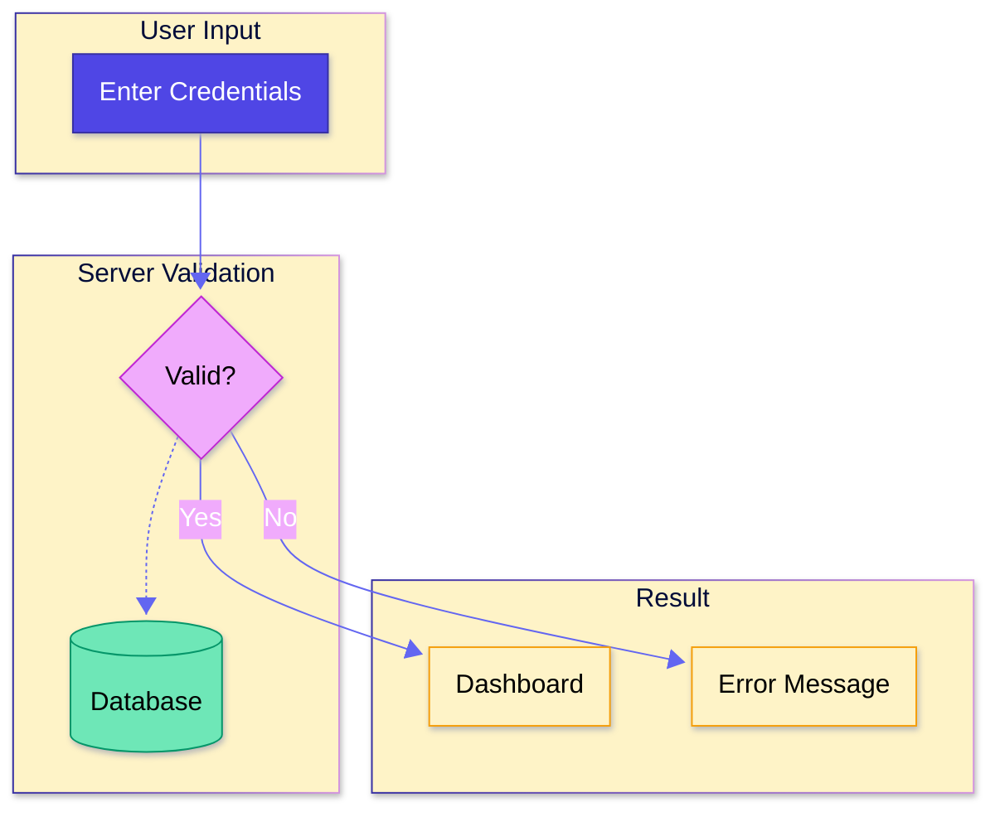
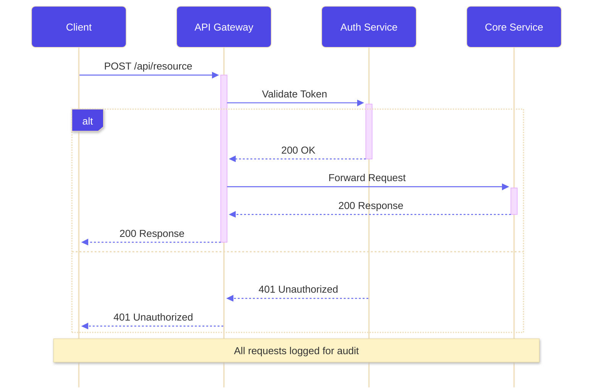
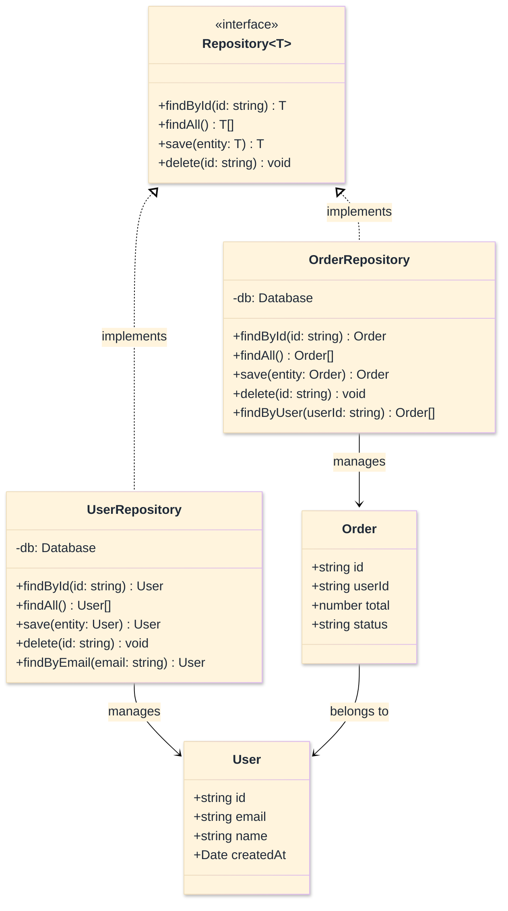
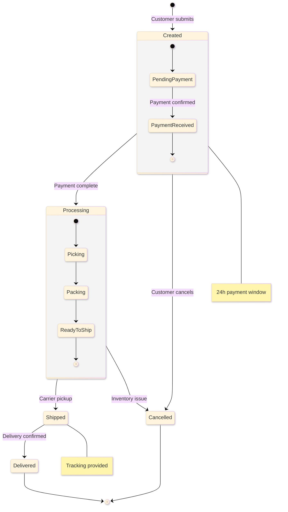
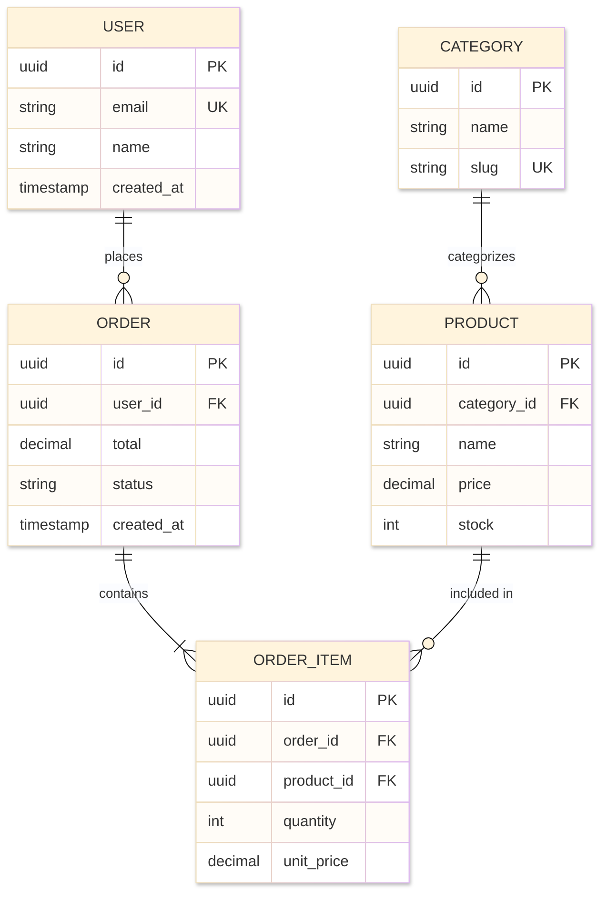
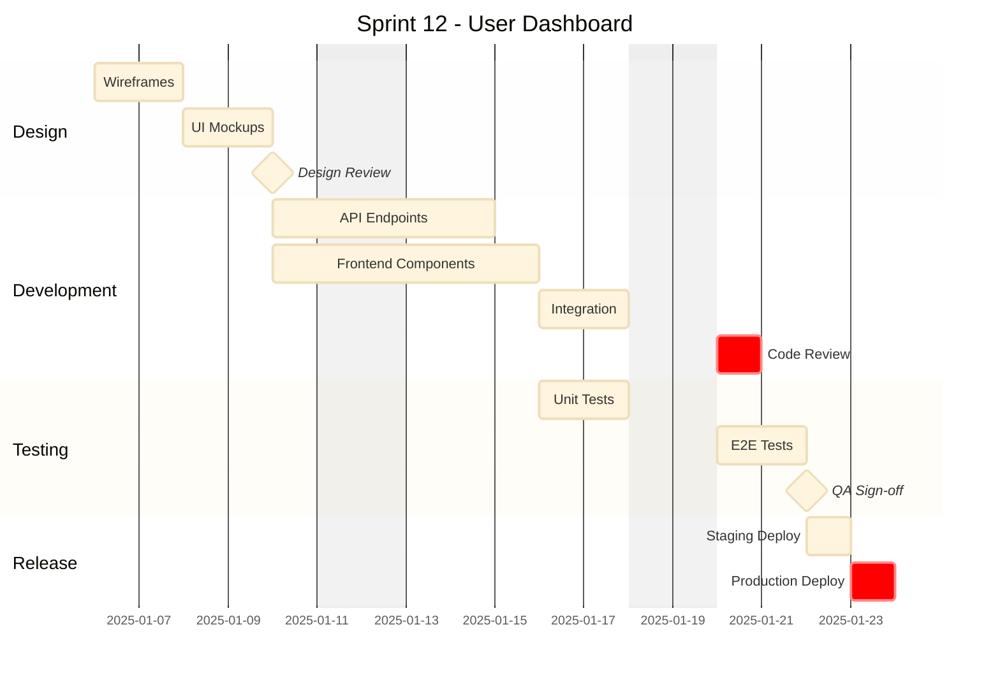
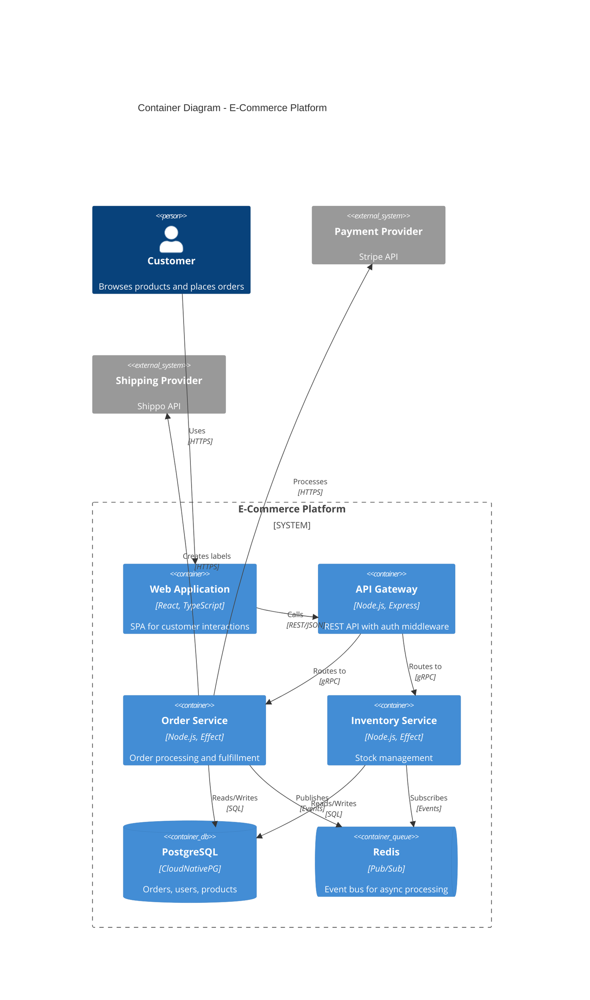

# [H1][EXAMPLES]
>**Dictum:** *End-to-end examples demonstrate complete diagram workflows.*

<br>

Complete working examples from configuration to rendered output; one example per diagram family.

---
## [1][FLOWCHART]
>**Dictum:** *Node-edge topology with styling and accessibility.*

<br>

### [1.1][COMPLETE_EXAMPLE]



### [1.2][KEY_ELEMENTS]

| [INDEX] | [ELEMENT] | [PURPOSE] |
| :-----: | --------- | --------- |
| [1] | YAML frontmatter | Theme, look, curve, spacing configuration |
| [2] | accTitle/accDescr | WCAG 2.1 accessibility compliance |
| [3] | subgraph | Logical grouping with labels |
| [4] | classDef | Reusable node styling |
| [5] | Edge variants | Solid (required), dotted (reference) |

---
## [2][SEQUENCE]
>**Dictum:** *Temporal interaction with control flow blocks.*

<br>

### [2.1][COMPLETE_EXAMPLE]



### [2.2][KEY_ELEMENTS]

| [INDEX] | [ELEMENT] | [PURPOSE] |
| :-----: | --------- | --------- |
| [1] | participant aliases | Short references in diagram |
| [2] | Activation (+/-) | Shows active processing |
| [3] | alt/else blocks | Conditional branching |
| [4] | Note over | Cross-participant annotations |
| [5] | Arrow types | Sync (->>), async (-->>), response (-->) |

---
## [3][CLASS]
>**Dictum:** *UML class relationships with generics and visibility.*

<br>

### [3.1][COMPLETE_EXAMPLE]



### [3.2][KEY_ELEMENTS]

| [INDEX] | [ELEMENT] | [PURPOSE] |
| :-----: | --------- | --------- |
| [1] | Generics (~T~) | Type parameters |
| [2] | Stereotypes (<<interface>>) | UML classifiers |
| [3] | Visibility (+/-/#/~) | Public/private/protected/package |
| [4] | Relationship arrows | Implements (..), association (-->) |
| [5] | ELK renderer | Improved layout algorithm |

---
## [4][STATE]
>**Dictum:** *State transitions with composite states and choices.*

<br>

### [4.1][COMPLETE_EXAMPLE]



### [4.2][KEY_ELEMENTS]

| [INDEX] | [ELEMENT] | [PURPOSE] |
| :-----: | --------- | --------- |
| [1] | Composite states | Nested state machines |
| [2] | [*] markers | Initial/final states |
| [3] | Transition labels | Event triggers |
| [4] | Notes | State annotations |
| [5] | stateDiagram-v2 | Modern syntax |

---
## [5][ENTITY_RELATIONSHIP]
>**Dictum:** *Data modeling with cardinality notation.*

<br>

### [5.1][COMPLETE_EXAMPLE]



### [5.2][KEY_ELEMENTS]

| [INDEX] | [ELEMENT] | [PURPOSE] |
| :-----: | --------- | --------- |
| [1] | Attribute types | uuid, string, decimal, timestamp |
| [2] | Key markers | PK (primary), FK (foreign), UK (unique) |
| [3] | Cardinality | `\|\|` (one), `o{` (zero-many), `\|{` (one-many) |
| [4] | Relationship labels | Verb describing association |
| [5] | layoutDirection | TB for vertical, LR for horizontal |

---
## [6][GANTT]
>**Dictum:** *Project timeline with dependencies and milestones.*

<br>

### [6.1][COMPLETE_EXAMPLE]



### [6.2][KEY_ELEMENTS]

| [INDEX] | [ELEMENT] | [PURPOSE] |
| :-----: | --------- | --------- |
| [1] | dateFormat | Input date parsing |
| [2] | excludes | Skip weekends/holidays |
| [3] | after keyword | Task dependencies |
| [4] | milestone | Zero-duration checkpoints |
| [5] | crit modifier | Critical path highlighting |
| [6] | Sections | Logical phase grouping |

---
## [7][C4_ARCHITECTURE]
>**Dictum:** *System architecture with C4 abstraction levels.*

<br>

### [7.1][COMPLETE_EXAMPLE]



### [7.2][KEY_ELEMENTS]

| [INDEX] | [ELEMENT] | [PURPOSE] |
| :-----: | --------- | --------- |
| [1] | C4Container | Container-level diagram |
| [2] | Person | External actors |
| [3] | System_Boundary | Platform boundary |
| [4] | Container/ContainerDb/ContainerQueue | Typed containers |
| [5] | System_Ext | External dependencies |
| [6] | Rel | Relationships with protocols |
| [7] | UpdateLayoutConfig | Layout tuning |

---
## [8][MINDMAP]
>**Dictum:** *Hierarchical knowledge with icons and shapes.*

<br>

### [8.1][COMPLETE_EXAMPLE]

```mermaid
---
config:
  theme: base
  look: neo
  mindmap:
    padding: 20
    maxNodeWidth: 200
---
mindmap
    accTitle: Frontend Architecture
    accDescr: Shows frontend technology stack organized by concern with frameworks, state, and tooling.

    root((Frontend Stack))
        Framework
            React 19
                Server Components
                Suspense
                Transitions
            TypeScript 6
                Strict Mode
                Type Inference
        State
            Effect
                Services
                Layers
            Zustand
                Stores
                Selectors
        Styling
            Tailwind v4
                @theme
                OKLCH
            LightningCSS
                Native Transforms
        Build
            Vite 7
                HMR
                ESBuild
            Nx 22
                Caching
                Affected
        Testing
            Vitest
                Coverage
                Mocking
            Playwright
                E2E
                Visual
```

### [8.2][KEY_ELEMENTS]

| [INDEX] | [ELEMENT] | [PURPOSE] |
| :-----: | --------- | --------- |
| [1] | root(()) | Central node with circle shape |
| [2] | Indentation | Hierarchy via whitespace |
| [3] | maxNodeWidth | Prevents text overflow |
| [4] | Leaf nodes | Terminal concepts |
| [5] | No explicit edges | Hierarchy implies connections |

---
## [9][VERIFY]
>**Dictum:** *Example completeness ensures reference utility.*

<br>

[VERIFY] Examples:
- [ ] Each example includes YAML frontmatter with theme and config.
- [ ] Each example includes accTitle and accDescr for accessibility.
- [ ] Each example demonstrates diagram-specific features.
- [ ] Key elements table explains syntax patterns.
- [ ] Examples render without errors in mermaid-cli.
