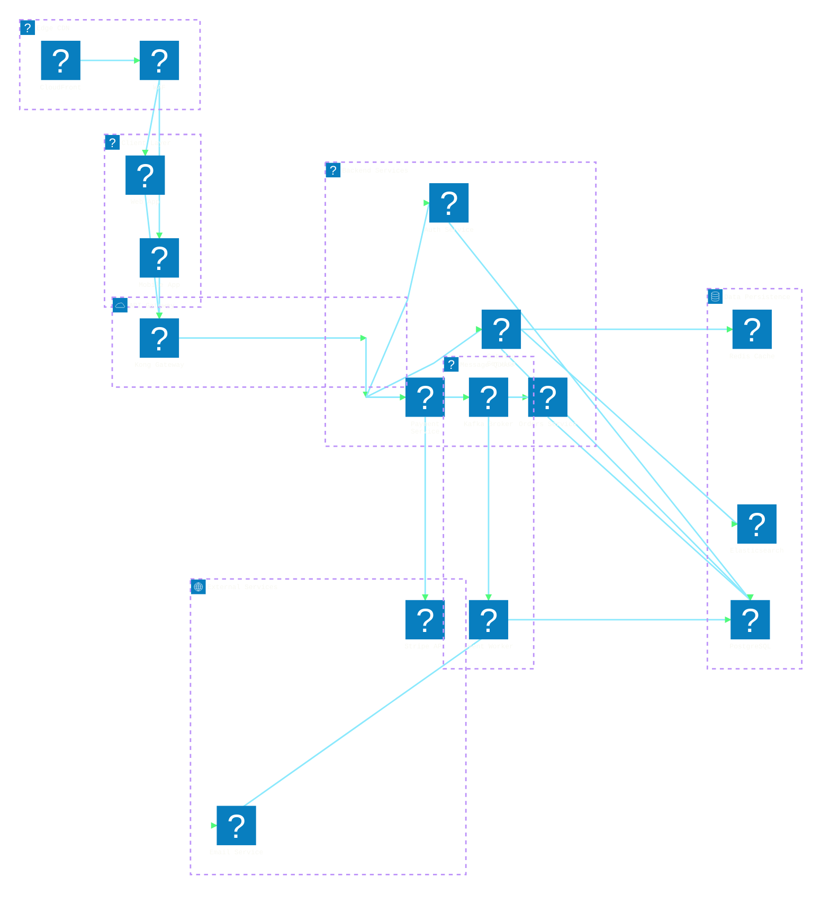

```mermaid
---
config:
  layout: elk
  look: neo
  theme: base
  elk:
    mergeEdges: false
    nodePlacementStrategy: NETWORK_SIMPLEX
    cycleBreakingStrategy: GREEDY
    layering: NETWORK_SIMPLEX
    spacing:
      nodeNode: 80
      edgeNode: 40
      edgeEdge: 30
    padding: "[top=50,left=50,bottom=50,right=50]"
    hierarchyHandling: INCLUDE_CHILDREN
  themeVariables:
    background: "#282a36"
    fontFamily: "JetBrains Mono, monospace"
    fontSize: "14px"
    primaryColor: "#44475a"
    primaryTextColor: "#f8f8f2"
    primaryBorderColor: "#6272a4"
    lineColor: "#6272a4"
    archEdgeColor: "#8be9fd"
    archEdgeArrowColor: "#50fa7b"
    archEdgeWidth: "3"
    archGroupBorderColor: "#bd93f9"
    archGroupBorderWidth: "3"
---
architecture-beta
    accTitle: E-Commerce Platform Architecture
    accDescr: Cloud-native microservices platform with clear request flow from edge to services to data, demonstrating proper ELK spacing, hierarchical organization, and logical service grouping.
    group cdn(logos:cloudflare)[Edge CDN]
    service cloudfront(logos:cloudflare-workers)[CloudFront] in cdn
    service waf(mdi:shield-check)[WAF] in cdn
    group clients(logos:react)[Client Layer]
    service web(logos:react)[Web App] in clients
    service mobile(logos:flutter)[Mobile App] in clients
    group gateway(cloud)[API Gateway]
    service apigw(logos:kong)[Kong Gateway] in gateway
    junction gwJunction in gateway
    group backend(logos:kubernetes)[Backend Services]
    service auth(mdi:account-key)[Auth Service] in backend
    service catalog(mdi:storefront)[Catalog Service] in backend
    service orders(mdi:cart)[Orders Service] in backend
    service payments(mdi:credit-card)[Payment Service] in backend
    junction backendHub in backend
    group messaging(logos:apache-kafka)[Message Queue]
    service kafka(logos:apache-kafka)[Kafka Broker] in messaging
    service worker(mdi:cog)[Event Worker] in messaging
    group persistence(database)[Data Persistence]
    service postgres(logos:postgresql)[PostgreSQL] in persistence
    service redis(logos:redis)[Redis Cache] in persistence
    service elastic(logos:elasticsearch)[Elasticsearch] in persistence
    group external(internet)[External Services]
    service stripe(logos:stripe)[Stripe API] in external
    service email(mdi:email)[Email Service] in external
    cloudfront:R --> L:waf
    waf:B --> T:web
    waf:B --> T:mobile
    web:B --> T:apigw
    mobile:B --> T:apigw
    apigw:R --> L:gwJunction
    gwJunction:B --> T:backendHub
    backendHub:R --> L:auth
    backendHub:R --> L:catalog
    backendHub:R --> L:orders
    backendHub:R --> L:payments
    auth:B --> T:postgres
    catalog:B --> T:postgres
    catalog:R --> L:elastic
    catalog:R --> L:redis
    orders:B --> T:postgres
    orders:R --> L:kafka
    payments:B --> T:stripe
    payments:R --> L:kafka
    kafka:B --> T:worker
    worker:R --> L:email
    worker:R --> L:postgres
```
