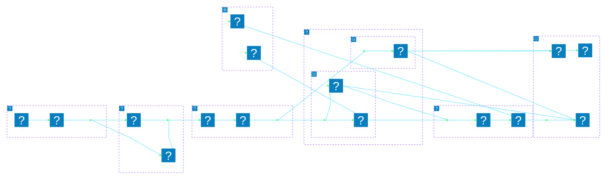

```mermaid
---
config:
  layout: elk
  look: neo
  theme: base
  elk:
    mergeEdges: false
    nodePlacementStrategy: BRANDES_KOEPF
    cycleBreakingStrategy: GREEDY_MODEL_ORDER
    layering: LONGEST_PATH
    direction: RIGHT
    edgeRouting: SPLINES
    spacing:
      nodeNode: 100
      edgeNode: 60
      edgeEdge: 40
      componentComponent: 70
    padding: "[top=80,left=80,bottom=80,right=80]"
    hierarchyHandling: INCLUDE_CHILDREN
    separateConnectedComponents: false
    aspectRatio: 1.6
  themeVariables:
    background: "#282a36"
    fontFamily: "JetBrains Mono, monospace"
    fontSize: "15px"
    primaryColor: "#44475a"
    primaryTextColor: "#f8f8f2"
    primaryBorderColor: "#bd93f9"
    lineColor: "#6272a4"
    archEdgeColor: "#8be9fd"
    archEdgeArrowColor: "#50fa7b"
    archEdgeWidth: "3.5"
    archGroupBorderColor: "#bd93f9"
    archGroupBorderWidth: "3.5"
---
architecture-beta
    accTitle: Cloud-Native E-Commerce Platform
    accDescr: Production architecture demonstrating clean left-to-right flow with strategic grouping, no crossing arrows, enhanced Dracula styling, and advanced ELK configurations for optimal layout.
    group ingress(logos:cloudflare)[Ingress Layer]
    service cdn(logos:cloudflare-workers)[CDN] in ingress
    service waf(mdi:shield-check)[WAF] in ingress
    junction ingressHub in ingress
    group presentation(logos:react)[Presentation Layer]
    service webapp(logos:react)[Web App] in presentation
    service mobileapp(logos:flutter)[Mobile App] in presentation
    junction presentationHub in presentation
    group routing(mdi:router-network)[Routing Layer]
    service apigateway(logos:kong)[API Gateway] in routing
    service loadbalancer(mdi:web)[Load Balancer] in routing
    junction routingHub in routing
    group application(logos:kubernetes)[Application Layer]
    group core(server)[Core Services] in application
    service auth(mdi:account-key)[Auth] in core
    service catalog(mdi:storefront)[Catalog] in core
    junction coreHub in core
    group transactional(server)[Transaction Services] in application
    service orders(mdi:cart)[Orders] in transactional
    service payments(mdi:credit-card)[Payments] in transactional
    junction txHub in transactional
    group integration(logos:apache-kafka)[Integration Layer]
    service eventbus(logos:apache-kafka)[Event Bus] in integration
    service processor(mdi:cog)[Processor] in integration
    junction integrationHub in integration
    group datastore(database)[Data Layer]
    service primarydb(logos:postgresql)[Primary DB] in datastore
    service cachedb(logos:redis)[Cache] in datastore
    service searchdb(logos:elasticsearch)[Search] in datastore
    junction dataHub in datastore
    group external(internet)[External Layer]
    service paymentgateway(logos:stripe)[Payment Gateway] in external
    service notification(mdi:email)[Notifications] in external
    cdn:R --> L:waf
    waf:R --> L:ingressHub
    ingressHub:R --> L:webapp
    ingressHub:R --> L:mobileapp
    webapp:R --> L:presentationHub
    mobileapp:R --> L:presentationHub
    presentationHub:R --> L:apigateway
    apigateway:R --> L:loadbalancer
    loadbalancer:R --> L:routingHub
    routingHub:R --> L:coreHub
    routingHub:R --> L:txHub
    coreHub:R --> L:auth
    coreHub:R --> L:catalog
    txHub:R --> L:orders
    txHub:R --> L:payments
    auth:R --> L:primarydb
    catalog:R --> L:cachedb
    catalog:R --> L:searchdb
    orders:R --> L:primarydb
    orders:R --> L:integrationHub
    payments:R --> L:paymentgateway
    payments:R --> L:integrationHub
    integrationHub:R --> L:eventbus
    eventbus:R --> L:processor
    processor:R --> L:notification
    processor:R --> L:dataHub
    dataHub:R --> L:primarydb
```
