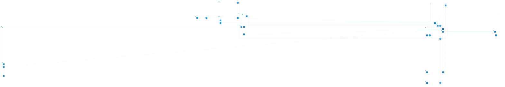

```mermaid
---
config:
  layout: elk
  look: neo
  theme: base
  elk: {mergeEdges: true, nodePlacementStrategy: BRANDES_KOEPF, cycleBreakingStrategy: GREEDY_MODEL_ORDER, forceNodeModelOrder: true, considerModelOrder: NODES_AND_EDGES}
  themeVariables: {background: "#282a36", fontFamily: "JetBrains Mono, monospace", fontSize: "12px", primaryColor: "#44475a", primaryTextColor: "#f8f8f2", primaryBorderColor: "#6272a4", lineColor: "#6272a4", archEdgeColor: "#8be9fd", archEdgeArrowColor: "#50fa7b", archEdgeWidth: "2", archGroupBorderColor: "#bd93f9", archGroupBorderWidth: "2"}
---
architecture-beta
    accTitle: Cloud-Native Microservices Platform
    accDescr: Production distributed system demonstrating edge CDN, API gateway, service mesh, event streaming, polyglot persistence, serverless, observability, and security layers with advanced iconify icons.
    group edge(logos:cloudflare)[Edge Layer]
    service cdn(logos:cloudflare-workers)[CDN] in edge
    service waf(mdi:shield-lock)[WAF] in edge
    junction edgeHub in edge
    group frontend(logos:react)[Frontend]
    service spa(logos:react)[React SPA] in frontend
    service mobile(logos:flutter)[Mobile App] in frontend
    group gateway(cloud)[API Gateway]
    service kong(logos:kong)[Kong] in gateway
    service envoy(logos:envoyproxy)[Envoy] in gateway
    junction gwHub in gateway
    group mesh(logos:kubernetes)[Service Mesh]
    service istio(logos:istio)[Istio] in mesh
    service linkerd(simple-icons:linkerd)[Linkerd] in mesh
    group services(server)[Backend Services]
    group k8s(logos:kubernetes)[Kubernetes] in services
    service auth(mdi:account-key)[Auth] in k8s
    service catalog(mdi:book-open)[Catalog] in k8s
    service orders(mdi:cart)[Orders] in k8s
    service payment(mdi:credit-card)[Payment] in k8s
    junction k8sHub in k8s
    group lambda(logos:aws-lambda)[Serverless] in services
    service imgProcess(mdi:image-size-select-actual)[ImageProc] in lambda
    service pdfGen(mdi:file-pdf-box)[PdfGen] in lambda
    group async(logos:apache-kafka)[Event Streaming]
    service kafka(logos:apache-kafka)[Kafka] in async
    service pulsar(logos:apache-pulsar)[Pulsar] in async
    junction asyncHub in async
    group data(database)[Data Layer]
    group sql(logos:postgresql)[SQL] in data
    service postgres(logos:postgresql)[Postgres] in sql
    service cockroach(simple-icons:cockroachlabs)[CockroachDB] in sql
    group nosql(logos:mongodb)[NoSQL] in data
    service mongo(logos:mongodb)[MongoDB] in nosql
    service cassandra(logos:cassandra)[Cassandra] in nosql
    group cache(logos:redis)[Cache] in data
    service redis(logos:redis)[Redis] in cache
    service memcached(simple-icons:memcached)[Memcached] in cache
    group search(logos:elasticsearch)[Search] in data
    service elastic(logos:elasticsearch)[Elastic] in search
    service opensearch(simple-icons:opensearch)[OpenSearch] in search
    group obs(mdi:monitor-dashboard)[Observability]
    service prometheus(logos:prometheus)[Prometheus] in obs
    service grafana(logos:grafana)[Grafana] in obs
    service jaeger(simple-icons:jaeger)[Jaeger] in obs
    junction obsHub in obs
    group security(mdi:shield-check)[Security]
    service vault(logos:vault)[Vault] in security
    service keycloak(simple-icons:keycloak)[Keycloak] in security
    group external(internet)[External]
    service stripe(logos:stripe)[Stripe] in external
    service s3(logos:amazon-s3)[S3] in external
    cdn:R --> L:waf
    waf:R --> L:edgeHub
    edgeHub:B --> T:spa
    edgeHub:B --> T:mobile
    spa:B --> T:kong
    mobile:B --> T:envoy
    kong:R --> L:gwHub
    envoy:R --> L:gwHub
    gwHub:B --> T:istio
    istio:R --> L:linkerd
    istio:B --> T:k8sHub
    linkerd:B --> T:k8sHub
    k8sHub:R --> L:auth
    k8sHub:R --> L:catalog
    k8sHub:R --> L:orders
    k8sHub:B --> T:payment
    auth:B --> T:keycloak
    catalog:R --> L:elastic
    orders:B --> T:postgres
    orders:R --> L:asyncHub
    payment:B --> T:stripe
    asyncHub:L --> R:kafka
    asyncHub:L --> R:pulsar
    kafka:B --> T:imgProcess
    kafka:R --> L:mongo
    pulsar:B --> T:pdfGen
    postgres:R --> L:redis
    mongo:R --> L:memcached
    cassandra:R --> L:opensearch
    catalog:T --> B:opensearch
    k8sHub:L --> R:obsHub
    gwHub:L --> R:prometheus
    asyncHub:T --> B:jaeger
    obsHub:R --> L:prometheus
    obsHub:R --> L:grafana
    vault:B --> T:auth
    imgProcess:B --> T:s3
    cockroach:R --> L:redis
```
