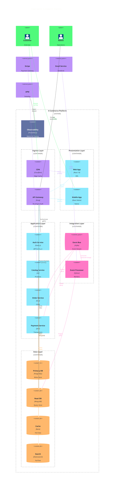

```mermaid
---
config:
  layout: elk
  look: neo
  theme: base
  elk:
    mergeEdges: false
    nodePlacementStrategy: BRANDES_KOEPF
    cycleBreakingStrategy: GREEDY_MODEL_ORDER
    layering: LONGEST_PATH
    edgeRouting: SPLINES
    spacing:
      nodeNode: 100
      edgeNode: 60
      edgeEdge: 40
      componentComponent: 70
    padding: "[top=80,left=80,bottom=80,right=80]"
    hierarchyHandling: INCLUDE_CHILDREN
    separateConnectedComponents: false
    aspectRatio: 1.6
  themeVariables:
    background: "#282a36"
    fontFamily: "JetBrains Mono, monospace"
    fontSize: "15px"
    primaryColor: "#44475a"
    primaryTextColor: "#f8f8f2"
    primaryBorderColor: "#bd93f9"
    lineColor: "#6272a4"
    cScale0: "#50fa7b"
    cScale1: "#8be9fd"
    cScale2: "#bd93f9"
    cScale3: "#ff79c6"
    cScale4: "#ffb86c"
    cScaleLabel0: "#282a36"
    cScaleLabel1: "#282a36"
    cScaleLabel2: "#282a36"
    cScaleLabel3: "#282a36"
    cScaleLabel4: "#282a36"
---
C4Container
    accTitle: Cloud-Native E-Commerce Platform
    accDescr: Production architecture with clean left-to-right flow, CQRS event sourcing, polyglot persistence, enhanced Dracula styling, and advanced ELK configuration for optimal container visualization.

    UpdateLayoutConfig($c4ShapeInRow="5", $c4BoundaryInRow="2")

    Person(customer, "Customer", "End User", $sprite="person", $link="https://docs.example.com/users")
    Person(admin, "Admin", "Operations", $sprite="person", $link="https://admin.example.com")
    
    System_Boundary(platform, "E-Commerce Platform", $link="https://github.com/org/ecommerce") {
        Container_Boundary(ingress, "Ingress Layer", $link="https://docs.example.com/ingress") {
            Container(cdn, "CDN", "Cloudflare", "Edge Cache", $sprite="cloud", $link="https://cloudflare.com")
            Container(gateway, "API Gateway", "Kong", "Routing & Auth", $sprite="server", $link="https://konghq.com")
        }
        
        Container_Boundary(presentation, "Presentation Layer", $link="https://docs.example.com/ui") {
            Container(web, "Web App", "React 19", "SPA", $sprite="browser", $link="https://github.com/org/web")
            Container(mobile, "Mobile App", "React Native", "Native", $sprite="mobile", $link="https://github.com/org/mobile")
        }
        
        Container_Boundary(application, "Application Layer", $link="https://docs.example.com/services") {
            Container(auth, "Auth Service", "Node.js", "JWT & OAuth", $sprite="key", $link="https://github.com/org/auth")
            Container(catalog, "Catalog Service", "Go", "Products", $sprite="book", $link="https://github.com/org/catalog")
            Container(order, "Order Service", "Rust", "CQRS", $sprite="shopping-cart", $link="https://github.com/org/orders")
            Container(payment, "Payment Service", "Java", "Transactions", $sprite="credit-card", $link="https://github.com/org/payment")
        }
        
        Container_Boundary(integration, "Integration Layer", $link="https://docs.example.com/async") {
            ContainerQueue(eventbus, "Event Bus", "Kafka", "Event Stream", $sprite="stream", $link="https://kafka.apache.org/docs")
            Container(processor, "Event Processor", "Python", "Workers", $sprite="cog", $link="https://github.com/org/processor")
        }
        
        Container_Boundary(persistence, "Data Layer", $link="https://docs.example.com/data") {
            ContainerDb(primarydb, "Primary DB", "PostgreSQL", "Write Store", $sprite="database", $link="https://postgresql.org/docs")
            ContainerDb(readdb, "Read DB", "MongoDB", "Query Store", $sprite="database", $link="https://mongodb.com/docs")
            ContainerDb(cache, "Cache", "Redis", "Hot Data", $sprite="bolt", $link="https://redis.io/docs")
            ContainerDb(search, "Search", "Elasticsearch", "Full-Text", $sprite="magnifying-glass", $link="https://elastic.co/docs")
        }
        
        Container(observability, "Observability", "Prometheus", "Metrics & Tracing", $sprite="chart-bar", $link="https://prometheus.io/docs")
    }
    
    System_Ext(stripe, "Stripe", "Payment Gateway", $sprite="credit-card", $link="https://stripe.com/docs")
    System_Ext(email, "Email Service", "SendGrid", $sprite="envelope", $link="https://sendgrid.com/docs")
    System_Ext(monitoring, "APM", "Datadog", $sprite="chart-line", $link="https://docs.datadoghq.com")

    Rel_R(customer, cdn, "Browse", "HTTPS")
    Rel_R(customer, mobile, "Use", "HTTPS")
    Rel_R(admin, gateway, "Manage", "Admin API")
    
    Rel_R(cdn, web, "Serve", "HTTP/3")
    Rel_R(web, gateway, "API Call", "JWT")
    Rel_R(mobile, gateway, "API Call", "OAuth2")
    
    Rel_R(gateway, auth, "Authenticate", "gRPC")
    Rel_R(gateway, catalog, "Query Products", "gRPC")
    Rel_R(gateway, order, "Place Order", "HTTP/2")
    Rel_R(gateway, payment, "Process Payment", "HTTP/2")
    
    Rel_R(auth, primarydb, "Verify", "SQL")
    Rel_R(catalog, readdb, "Read", "MongoDB")
    Rel_R(catalog, cache, "Cache", "Redis")
    Rel_R(catalog, search, "Index", "REST")
    
    Rel_R(order, primarydb, "Write", "SQL TX")
    Rel_R(order, eventbus, "Publish", "Avro")
    
    Rel_R(payment, stripe, "Charge", "REST")
    Rel_R(payment, eventbus, "Publish", "Avro")
    
    Rel_R(eventbus, processor, "Consume", "Consumer Group")
    Rel_R(processor, readdb, "Project", "CDC")
    Rel_R(processor, email, "Notify", "SMTP")
    
    Rel_R(observability, monitoring, "Export", "StatsD")

    UpdateElementStyle(customer, "#50fa7b", "#282a36", "#50fa7b", "true")
    UpdateElementStyle(admin, "#50fa7b", "#282a36", "#50fa7b", "true")
    
    UpdateElementStyle(cdn, "#bd93f9", "#282a36", "#bd93f9", "true")
    UpdateElementStyle(gateway, "#bd93f9", "#282a36", "#bd93f9", "true")
    
    UpdateElementStyle(web, "#8be9fd", "#282a36", "#8be9fd", "true")
    UpdateElementStyle(mobile, "#8be9fd", "#282a36", "#8be9fd", "true")
    
    UpdateElementStyle(auth, "#8be9fd", "#282a36", "#8be9fd", "true")
    UpdateElementStyle(catalog, "#8be9fd", "#282a36", "#8be9fd", "true")
    UpdateElementStyle(order, "#8be9fd", "#282a36", "#8be9fd", "true")
    UpdateElementStyle(payment, "#8be9fd", "#282a36", "#8be9fd", "true")
    
    UpdateElementStyle(eventbus, "#ff79c6", "#282a36", "#ff79c6", "true")
    UpdateElementStyle(processor, "#ff79c6", "#282a36", "#ff79c6", "true")
    
    UpdateElementStyle(primarydb, "#ffb86c", "#282a36", "#ffb86c", "true")
    UpdateElementStyle(readdb, "#ffb86c", "#282a36", "#ffb86c", "true")
    UpdateElementStyle(cache, "#ffb86c", "#282a36", "#ffb86c", "true")
    UpdateElementStyle(search, "#ffb86c", "#282a36", "#ffb86c", "true")
    
    UpdateElementStyle(observability, "#6272a4", "#f8f8f2", "#bd93f9", "true")
    
    UpdateElementStyle(stripe, "#bd93f9", "#282a36", "#bd93f9", "true")
    UpdateElementStyle(email, "#bd93f9", "#282a36", "#bd93f9", "true")
    UpdateElementStyle(monitoring, "#bd93f9", "#282a36", "#bd93f9", "true")

    UpdateRelStyle(customer, cdn, "#50fa7b", "#50fa7b")
    UpdateRelStyle(customer, mobile, "#50fa7b", "#50fa7b")
    UpdateRelStyle(cdn, web, "#bd93f9", "#bd93f9")
    UpdateRelStyle(web, gateway, "#8be9fd", "#8be9fd")
    UpdateRelStyle(mobile, gateway, "#8be9fd", "#8be9fd")
    UpdateRelStyle(gateway, catalog, "#8be9fd", "#8be9fd")
    UpdateRelStyle(gateway, order, "#8be9fd", "#8be9fd")
    UpdateRelStyle(order, eventbus, "#ff79c6", "#ff79c6")
    UpdateRelStyle(payment, eventbus, "#ff79c6", "#ff79c6")
    UpdateRelStyle(eventbus, processor, "#ff79c6", "#ff79c6")
    UpdateRelStyle(processor, readdb, "#ff79c6", "#ff79c6")
    UpdateRelStyle(order, primarydb, "#ffb86c", "#ffb86c")
    UpdateRelStyle(catalog, cache, "#ffb86c", "#ffb86c")
    UpdateRelStyle(catalog, search, "#ffb86c", "#ffb86c")
    UpdateRelStyle(payment, stripe, "#bd93f9", "#bd93f9")
    UpdateRelStyle(processor, email, "#bd93f9", "#bd93f9")
```
