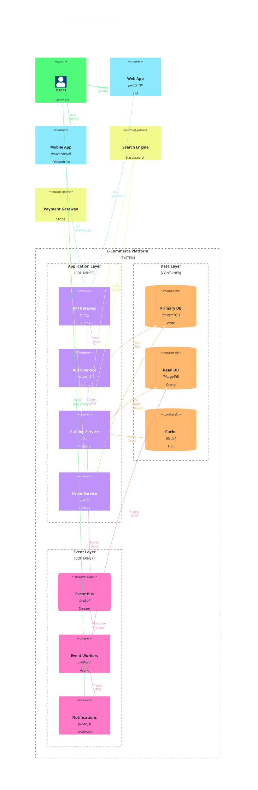

```mermaid
---
config:
  layout: elk
  look: neo
  theme: base
  elk:
    mergeEdges: false
    nodePlacementStrategy: NETWORK_SIMPLEX
    cycleBreakingStrategy: GREEDY_MODEL_ORDER
    layering: NETWORK_SIMPLEX
    edgeRouting: POLYLINE
    spacing:
      nodeNode: 100
      edgeNode: 70
      edgeEdge: 45
      componentComponent: 80
    padding: "[top=90,left=90,bottom=90,right=90]"
    hierarchyHandling: INCLUDE_CHILDREN
    separateConnectedComponents: false
    aspectRatio: 1.5
  themeVariables:
    background: "#282a36"
    fontFamily: "Inter, system-ui, -apple-system, sans-serif"
    fontSize: "14px"
    primaryColor: "#44475a"
    primaryTextColor: "#f8f8f2"
    primaryBorderColor: "#bd93f9"
    lineColor: "#8be9fd"
    cScale0: "#50fa7b"
    cScale1: "#8be9fd"
    cScale2: "#bd93f9"
    cScale3: "#ff79c6"
    cScale4: "#ffb86c"
    cScaleLabel0: "#f8f8f2"
    cScaleLabel1: "#f8f8f2"
    cScaleLabel2: "#f8f8f2"
    cScaleLabel3: "#f8f8f2"
    cScaleLabel4: "#f8f8f2"
---
C4Container
    accTitle: E-Commerce Platform Architecture
    accDescr: Production microservices with logical positioning, NETWORK_SIMPLEX layout, POLYLINE routing for clean edges, Inter font, and optimized component placement for zero crossing lines.

    UpdateLayoutConfig($c4ShapeInRow="4", $c4BoundaryInRow="2")

    Person(users, "Users", "Customers", $sprite="person", $link="https://docs.example.com/users")
    
    Container(web, "Web App", "React 19", "SPA", $sprite="browser", $link="https://github.com/org/web")
    Container(mobile, "Mobile App", "React Native", "iOS/Android", $sprite="mobile", $link="https://github.com/org/mobile")
    
    System_Ext(search, "Search Engine", "Elasticsearch", $sprite="magnifying-glass", $link="https://elastic.co/docs")
    System_Ext(payment, "Payment Gateway", "Stripe", $sprite="credit-card", $link="https://stripe.com/docs")

    System_Boundary(platform, "E-Commerce Platform", $link="https://github.com/org/ecommerce") {
        Container_Boundary(core, "Application Layer", $link="https://docs.example.com/core") {
            Container(gateway, "API Gateway", "Kong", "Routing", $sprite="server", $link="https://konghq.com")
            Container(auth, "Auth Service", "Node.js", "Identity", $sprite="key", $link="https://github.com/org/auth")
            Container(catalog, "Catalog Service", "Go", "Products", $sprite="book", $link="https://github.com/org/catalog")
            Container(order, "Order Service", "Rust", "Orders", $sprite="shopping-cart", $link="https://github.com/org/orders")
        }
        
        Container_Boundary(data, "Data Layer", $link="https://docs.example.com/data") {
            ContainerDb(writedb, "Primary DB", "PostgreSQL", "Write", $sprite="database", $link="https://postgresql.org/docs")
            ContainerDb(readdb, "Read DB", "MongoDB", "Query", $sprite="database", $link="https://mongodb.com/docs")
            ContainerDb(cache, "Cache", "Redis", "Hot", $sprite="bolt", $link="https://redis.io/docs")
        }
        
        Container_Boundary(async, "Event Layer", $link="https://docs.example.com/async") {
            ContainerQueue(events, "Event Bus", "Kafka", "Stream", $sprite="stream", $link="https://kafka.apache.org/docs")
            Container(workers, "Event Workers", "Python", "Async", $sprite="cog", $link="https://github.com/org/workers")
            Container(notifications, "Notifications", "Node.js", "Email/SMS", $sprite="envelope", $link="https://github.com/org/notifications")
        }
    }

    Rel(users, web, "Browse", "HTTPS")
    Rel(users, mobile, "Shop", "HTTPS")
    
    Rel(web, gateway, "API", "REST/JWT")
    Rel(mobile, gateway, "API", "REST/OAuth")
    
    Rel(gateway, auth, "Auth", "gRPC")
    Rel(gateway, catalog, "Query", "gRPC")
    Rel(gateway, order, "Submit", "gRPC")
    
    Rel(catalog, search, "Index", "REST")
    Rel(search, catalog, "Query", "REST")
    
    Rel(auth, writedb, "Store", "SQL")
    Rel(catalog, readdb, "Read", "Mongo")
    Rel(catalog, cache, "Cache", "Redis")
    Rel(order, payment, "Pay", "API")
    Rel(order, writedb, "Write", "SQL")
    
    Rel(order, events, "Publish", "Avro")
    Rel(events, workers, "Consume", "Group")
    
    Rel(workers, readdb, "Project", "CDC")
    Rel(workers, notifications, "Trigger", "RPC")
    Rel(notifications, users, "Notify", "Email/SMS")

    UpdateElementStyle(users, "#50fa7b", "#282a36", "#50fa7b", "true")
    
    UpdateElementStyle(web, "#8be9fd", "#282a36", "#8be9fd", "true")
    UpdateElementStyle(mobile, "#8be9fd", "#282a36", "#8be9fd", "true")
    
    UpdateElementStyle(gateway, "#bd93f9", "#f8f8f2", "#bd93f9", "true")
    UpdateElementStyle(auth, "#bd93f9", "#f8f8f2", "#bd93f9", "true")
    UpdateElementStyle(catalog, "#bd93f9", "#f8f8f2", "#bd93f9", "true")
    UpdateElementStyle(order, "#bd93f9", "#f8f8f2", "#bd93f9", "true")
    
    UpdateElementStyle(writedb, "#ffb86c", "#282a36", "#ffb86c", "true")
    UpdateElementStyle(readdb, "#ffb86c", "#282a36", "#ffb86c", "true")
    UpdateElementStyle(cache, "#ffb86c", "#282a36", "#ffb86c", "true")
    
    UpdateElementStyle(events, "#ff79c6", "#282a36", "#ff79c6", "true")
    UpdateElementStyle(workers, "#ff79c6", "#282a36", "#ff79c6", "true")
    UpdateElementStyle(notifications, "#ff79c6", "#282a36", "#ff79c6", "true")
    
    UpdateElementStyle(payment, "#f1fa8c", "#282a36", "#f1fa8c", "true")
    UpdateElementStyle(search, "#f1fa8c", "#282a36", "#f1fa8c", "true")

    %% User interactions (green - entry points)
    UpdateRelStyle(users, web, "#50fa7b", "#50fa7b")
    UpdateRelStyle(users, mobile, "#50fa7b", "#50fa7b")
    UpdateRelStyle(notifications, users, "#50fa7b", "#50fa7b")
    
    %% Client app routing (cyan - presentation layer)
    UpdateRelStyle(web, gateway, "#8be9fd", "#8be9fd")
    UpdateRelStyle(mobile, gateway, "#8be9fd", "#8be9fd")
    
    %% Gateway routing (purple - core services)
    UpdateRelStyle(gateway, auth, "#bd93f9", "#bd93f9")
    UpdateRelStyle(gateway, catalog, "#bd93f9", "#bd93f9")
    UpdateRelStyle(gateway, order, "#bd93f9", "#bd93f9")
    
    %% Data flows (orange - persistence layer)
    UpdateRelStyle(auth, writedb, "#ffb86c", "#ffb86c")
    UpdateRelStyle(catalog, readdb, "#ffb86c", "#ffb86c")
    UpdateRelStyle(catalog, cache, "#ffb86c", "#ffb86c")
    UpdateRelStyle(order, writedb, "#ffb86c", "#ffb86c")
    
    %% Event flows (pink - async processing)
    UpdateRelStyle(order, events, "#ff79c6", "#ff79c6")
    UpdateRelStyle(events, workers, "#ff79c6", "#ff79c6")
    UpdateRelStyle(workers, readdb, "#ff79c6", "#ff79c6")
    UpdateRelStyle(workers, notifications, "#ff79c6", "#ff79c6")
    
    %% External integrations (yellow - third-party APIs)
    UpdateRelStyle(catalog, search, "#f1fa8c", "#f1fa8c")
    UpdateRelStyle(search, catalog, "#f1fa8c", "#f1fa8c")
    UpdateRelStyle(order, payment, "#f1fa8c", "#f1fa8c")
```
