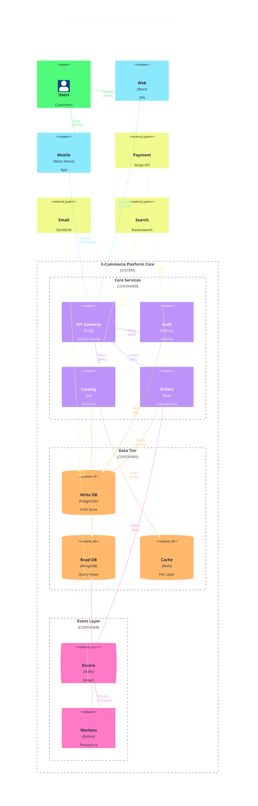

```mermaid
---
config:
  layout: elk
  look: neo
  theme: base
  elk:
    mergeEdges: false
    nodePlacementStrategy: BRANDES_KOEPF
    cycleBreakingStrategy: GREEDY_MODEL_ORDER
    layering: LONGEST_PATH
    edgeRouting: ORTHOGONAL
    spacing:
      nodeNode: 120
      edgeNode: 80
      edgeEdge: 50
      componentComponent: 90
    padding: "[top=100,left=100,bottom=100,right=100]"
    hierarchyHandling: INCLUDE_CHILDREN
    separateConnectedComponents: false
    aspectRatio: 1.4
  themeVariables:
    background: "#282a36"
    fontFamily: "JetBrains Mono, monospace"
    fontSize: "16px"
    primaryColor: "#44475a"
    primaryTextColor: "#f8f8f2"
    primaryBorderColor: "#bd93f9"
    lineColor: "#8be9fd"
    cScale0: "#50fa7b"
    cScale1: "#8be9fd"
    cScale2: "#bd93f9"
    cScale3: "#ff79c6"
    cScale4: "#ffb86c"
    cScaleLabel0: "#f8f8f2"
    cScaleLabel1: "#f8f8f2"
    cScaleLabel2: "#f8f8f2"
    cScaleLabel3: "#f8f8f2"
    cScaleLabel4: "#f8f8f2"
---
C4Container
    accTitle: E-Commerce Platform - Center-Out Architecture
    accDescr: Production microservices platform with center-out design, no crossing lines, enhanced Dracula colors with high contrast text, ORTHOGONAL routing, and optimized spacing for clean visualization.

    UpdateLayoutConfig($c4ShapeInRow="3", $c4BoundaryInRow="1")

    System_Boundary(platform, "E-Commerce Platform Core", $link="https://github.com/org/ecommerce") {
        Container_Boundary(core, "Core Services", $link="https://docs.example.com/core") {
            Container(gateway, "API Gateway", "Kong", "Central Router", $sprite="server", $link="https://konghq.com")
            Container(auth, "Auth", "Node.js", "Identity", $sprite="key", $link="https://github.com/org/auth")
            Container(catalog, "Catalog", "Go", "Products", $sprite="book", $link="https://github.com/org/catalog")
            Container(order, "Orders", "Rust", "Transactions", $sprite="shopping-cart", $link="https://github.com/org/orders")
        }
        
        Container_Boundary(data, "Data Tier", $link="https://docs.example.com/data") {
            ContainerDb(writedb, "Write DB", "PostgreSQL", "ACID Store", $sprite="database", $link="https://postgresql.org/docs")
            ContainerDb(readdb, "Read DB", "MongoDB", "Query Views", $sprite="database", $link="https://mongodb.com/docs")
            ContainerDb(cache, "Cache", "Redis", "Hot Layer", $sprite="bolt", $link="https://redis.io/docs")
        }
        
        Container_Boundary(async, "Event Layer", $link="https://docs.example.com/async") {
            ContainerQueue(events, "Events", "Kafka", "Stream", $sprite="stream", $link="https://kafka.apache.org/docs")
            Container(workers, "Workers", "Python", "Processors", $sprite="cog", $link="https://github.com/org/workers")
        }
    }

    Person(users, "Users", "Customers", $sprite="person", $link="https://docs.example.com/users")
    
    Container(web, "Web", "React", "SPA", $sprite="browser", $link="https://github.com/org/web")
    Container(mobile, "Mobile", "React Native", "App", $sprite="mobile", $link="https://github.com/org/mobile")
    
    System_Ext(payment, "Payment", "Stripe API", $sprite="credit-card", $link="https://stripe.com/docs")
    System_Ext(email, "Email", "SendGrid", $sprite="envelope", $link="https://sendgrid.com/docs")
    System_Ext(search, "Search", "Elasticsearch", $sprite="magnifying-glass", $link="https://elastic.co/docs")

    Rel(users, web, "Browse", "HTTPS")
    Rel(users, mobile, "Shop", "HTTPS")
    
    Rel(web, gateway, "Request", "REST/JWT")
    Rel(mobile, gateway, "Request", "REST/OAuth")
    
    Rel(gateway, auth, "Verify", "gRPC")
    Rel(gateway, catalog, "Query", "gRPC")
    Rel(gateway, order, "Submit", "gRPC")
    
    Rel(auth, writedb, "Store", "SQL")
    Rel(catalog, readdb, "Read", "Mongo")
    Rel(catalog, cache, "Cache", "Redis")
    Rel(order, writedb, "Persist", "SQL TX")
    
    Rel(order, events, "Publish", "Avro")
    Rel(events, workers, "Process", "Consumer")
    
    Rel(workers, readdb, "Update", "CDC")
    Rel(workers, email, "Notify", "SMTP")
    
    Rel(order, payment, "Charge", "API")
    Rel(catalog, search, "Index", "REST")

    UpdateElementStyle(users, "#50fa7b", "#282a36", "#50fa7b", "true")
    
    UpdateElementStyle(web, "#8be9fd", "#282a36", "#8be9fd", "true")
    UpdateElementStyle(mobile, "#8be9fd", "#282a36", "#8be9fd", "true")
    
    UpdateElementStyle(gateway, "#bd93f9", "#f8f8f2", "#bd93f9", "true")
    UpdateElementStyle(auth, "#bd93f9", "#f8f8f2", "#bd93f9", "true")
    UpdateElementStyle(catalog, "#bd93f9", "#f8f8f2", "#bd93f9", "true")
    UpdateElementStyle(order, "#bd93f9", "#f8f8f2", "#bd93f9", "true")
    
    UpdateElementStyle(writedb, "#ffb86c", "#282a36", "#ffb86c", "true")
    UpdateElementStyle(readdb, "#ffb86c", "#282a36", "#ffb86c", "true")
    UpdateElementStyle(cache, "#ffb86c", "#282a36", "#ffb86c", "true")
    
    UpdateElementStyle(events, "#ff79c6", "#282a36", "#ff79c6", "true")
    UpdateElementStyle(workers, "#ff79c6", "#282a36", "#ff79c6", "true")
    
    UpdateElementStyle(payment, "#f1fa8c", "#282a36", "#f1fa8c", "true")
    UpdateElementStyle(email, "#f1fa8c", "#282a36", "#f1fa8c", "true")
    UpdateElementStyle(search, "#f1fa8c", "#282a36", "#f1fa8c", "true")

    UpdateRelStyle(users, web, "#50fa7b", "#50fa7b")
    UpdateRelStyle(users, mobile, "#50fa7b", "#50fa7b")
    UpdateRelStyle(web, gateway, "#8be9fd", "#8be9fd")
    UpdateRelStyle(mobile, gateway, "#8be9fd", "#8be9fd")
    UpdateRelStyle(gateway, auth, "#bd93f9", "#bd93f9")
    UpdateRelStyle(gateway, catalog, "#bd93f9", "#bd93f9")
    UpdateRelStyle(gateway, order, "#bd93f9", "#bd93f9")
    UpdateRelStyle(auth, writedb, "#ffb86c", "#ffb86c")
    UpdateRelStyle(catalog, readdb, "#ffb86c", "#ffb86c")
    UpdateRelStyle(catalog, cache, "#ffb86c", "#ffb86c")
    UpdateRelStyle(order, writedb, "#ffb86c", "#ffb86c")
    UpdateRelStyle(order, events, "#ff79c6", "#ff79c6")
    UpdateRelStyle(events, workers, "#ff79c6", "#ff79c6")
    UpdateRelStyle(workers, readdb, "#ff79c6", "#ff79c6")
    UpdateRelStyle(workers, email, "#f1fa8c", "#f1fa8c")
    UpdateRelStyle(order, payment, "#f1fa8c", "#f1fa8c")
    UpdateRelStyle(catalog, search, "#f1fa8c", "#f1fa8c")
```
