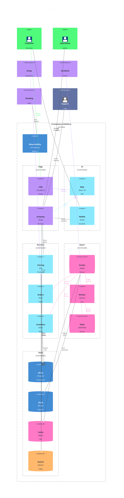

```mermaid
---
config:
  layout: elk
  look: neo
  theme: base
  elk: {mergeEdges: true, nodePlacementStrategy: LINEAR_SEGMENTS, cycleBreakingStrategy: GREEDY_MODEL_ORDER, forceNodeModelOrder: true, considerModelOrder: NODES_AND_EDGES}
  themeVariables:
    background: "#282a36"
    fontFamily: "Inter, system-ui, sans-serif"
    fontSize: "13px"
    primaryColor: "#44475a"
    primaryTextColor: "#f8f8f2"
    primaryBorderColor: "#6272a480"
    lineColor: "#6272a4"
    cScale0: "#50fa7b"
    cScale1: "#8be9fd"
    cScale2: "#bd93f9"
    cScale3: "#ff79c6"
    cScale4: "#ffb86c"
    cScaleLabel0: "#282a36"
    cScaleLabel1: "#282a36"
    cScaleLabel2: "#282a36"
    cScaleLabel3: "#282a36"
    cScaleLabel4: "#282a36"
---
C4Container
    accTitle: Event-Driven E-Commerce Platform
    accDescr: Production CQRS with event sourcing, polyglot persistence, API gateway, and observability.

    UpdateLayoutConfig($c4ShapeInRow="4", $c4BoundaryInRow="2")

    Person(customer, "Customer", "End User", $sprite="person", $link="https://docs.example.com/users")
    Person(admin, "Operations", "Admin", $sprite="person", $link="https://admin.example.com")
    System_Ext(stripe, "Stripe", "Payments", $sprite="credit-card", $link="https://stripe.com/docs")
    System_Ext(sendgrid, "SendGrid", "Email", $sprite="envelope", $link="https://sendgrid.com/docs")
    System_Ext(datadog, "Datadog", "APM", $sprite="chart-line", $link="https://docs.datadoghq.com")
    Person_Ext(support, "Support", "CRM", $sprite="headset", $link="https://support.example.com")

    System_Boundary(platform, "E-Commerce Platform", $link="https://github.com/org/ecommerce") {
        Container_Boundary(edge, "Edge", $link="https://docs.example.com/edge") {
            Container(cdn, "CDN", "Cloudflare", "Assets", $sprite="cloud", $link="https://cloudflare.com")
            Container(gateway, "Gateway", "Kong", "Routing", $sprite="server", $link="https://konghq.com")
        }
        Container_Boundary(ui, "UI", $link="https://docs.example.com/ui") {
            Container(web, "Web", "React 19", "SPA", $sprite="browser", $link="https://github.com/org/web")
            Container(mobile, "Mobile", "Node", "GraphQL", $sprite="mobile", $link="https://github.com/org/mobile")
        }
        Container_Boundary(svc, "Services", $link="https://docs.example.com/svc") {
            Container(catalog, "Catalog", "Go", "Products", $sprite="book", $link="https://github.com/org/catalog")
            Container(order, "Orders", "Rust", "CQRS", $sprite="shopping-cart", $link="https://github.com/org/orders")
            Container(inventory, "Inventory", "Elixir", "Stock", $sprite="warehouse", $link="https://github.com/org/inventory")
        }
        Container_Boundary(async, "Async", $link="https://docs.example.com/async") {
            ContainerQueue(events, "Events", "Kafka", "Stream", $sprite="stream", $link="https://kafka.apache.org/docs")
            Container(worker, "Worker", "Python", "Jobs", $sprite="cog", $link="https://github.com/org/worker")
            ContainerQueue(tasks, "Tasks", "RabbitMQ", "Queue", $sprite="list", $link="https://rabbitmq.com/docs")
        }
        Container_Boundary(data, "Data", $link="https://docs.example.com/data") {
            ContainerDb(wdb, "Write", "Postgres", "Commands", $sprite="database", $link="https://postgresql.org/docs")
            ContainerDb(rdb, "Read", "Mongo", "Queries", $sprite="database", $link="https://mongodb.com/docs")
            ContainerDb(cache, "Cache", "Redis", "Hot", $sprite="bolt", $link="https://redis.io/docs")
            ContainerDb(search, "Search", "Elastic", "Index", $sprite="magnifying-glass", $link="https://elastic.co/docs")
        }
        Container(obs, "Observability", "Prometheus", "Metrics", $sprite="chart-bar", $link="https://prometheus.io/docs")
    }

    Rel(customer, cdn, "Browse", "HTTPS", "Storefront")
    Rel(customer, mobile, "Use", "REST", "App")
    Rel(admin, gateway, "Manage", "Admin", "Ops")
    Rel(cdn, web, "Serve", "HTTP3", "Assets")
    Rel(web, gateway, "Call", "JWT", "Auth")
    Rel(mobile, gateway, "Query", "OAuth2", "Token")
    Rel(gateway, catalog, "Route", "gRPC", "Products")
    Rel(gateway, order, "Route", "HTTP/2", "Orders")
    Rel(gateway, inventory, "Route", "WS", "Stock")
    Rel(catalog, rdb, "Read", "Mongo", "Views")
    Rel(catalog, search, "Index", "REST", "Text")
    Rel(order, wdb, "Write", "SQL", "Commands")
    Rel(order, cache, "Cache", "RESP3", "Hot")
    Rel(order, events, "Publish", "Avro", "Created")
    Rel(inventory, wdb, "Update", "TX", "Stock")
    Rel(inventory, events, "Emit", "Proto", "Events")
    Rel(events, worker, "Trigger", "Group", "Consume")
    Rel(events, rdb, "Project", "CDC", "Views")
    Rel(worker, tasks, "Queue", "AMQP", "Jobs")
    Rel(order, stripe, "Charge", "API", "Pay")
    Rel(tasks, sendgrid, "Send", "SMTP", "Email")
    Rel(support, gateway, "Query", "OAuth2", "Support")
    Rel(obs, datadog, "Ship", "StatsD", "Metrics")
    BiRel(cache, events, "Sync", "Pub/Sub", "Invalidate")
    BiRel(search, catalog, "Query", "REST", "Facets")

    UpdateElementStyle(customer, "#50fa7b", "#282a36", "#50fa7b", "true")
    UpdateElementStyle(admin, "#50fa7b", "#282a36", "#50fa7b", "true")
    UpdateElementStyle(support, "#6272a4", "#f8f8f2", "#44475a", "false")
    
    UpdateElementStyle(cdn, "#bd93f9", "#282a36", "#bd93f9", "true")
    UpdateElementStyle(gateway, "#bd93f9", "#282a36", "#bd93f9", "true")
    
    UpdateElementStyle(web, "#8be9fd", "#282a36", "#8be9fd", "true")
    UpdateElementStyle(mobile, "#8be9fd", "#282a36", "#8be9fd", "true")
    
    UpdateElementStyle(catalog, "#8be9fd", "#282a36", "#8be9fd", "true")
    UpdateElementStyle(order, "#8be9fd", "#282a36", "#8be9fd", "true")
    UpdateElementStyle(inventory, "#8be9fd", "#282a36", "#8be9fd", "true")
    
    UpdateElementStyle(events, "#ff79c6", "#282a36", "#ff79c6", "true")
    UpdateElementStyle(worker, "#ff79c6", "#282a36", "#ff79c6", "true")
    UpdateElementStyle(tasks, "#ff79c6", "#282a36", "#ff79c6", "true")
    
    UpdateElementStyle(writedb, "#ffb86c", "#282a36", "#ffb86c", "true", "RoundedBoxShape")
    UpdateElementStyle(readdb, "#ffb86c", "#282a36", "#ffb86c", "true", "RoundedBoxShape")
    UpdateElementStyle(cache, "#ff79c6", "#282a36", "#ff79c6", "true", "RoundedBoxShape")
    UpdateElementStyle(search, "#ffb86c", "#282a36", "#ffb86c", "true", "RoundedBoxShape")
    
    UpdateElementStyle(telemetry, "#6272a4", "#f8f8f2", "#44475a", "false")
    UpdateElementStyle(stripe, "#bd93f9", "#282a36", "#bd93f9", "true")
    UpdateElementStyle(sendgrid, "#bd93f9", "#282a36", "#bd93f9", "true")
    UpdateElementStyle(datadog, "#bd93f9", "#282a36", "#bd93f9", "true")

    UpdateRelStyle(customer, cdn, "#50fa7b", "#50fa7b")
    UpdateRelStyle(cdn, web, "#bd93f9", "#bd93f9")
    UpdateRelStyle(web, gateway, "#8be9fd", "#8be9fd")
    UpdateRelStyle(gateway, order, "#8be9fd", "#8be9fd")
    UpdateRelStyle(order, events, "#ff79c6", "#ff79c6")
    UpdateRelStyle(events, worker, "#ff79c6", "#ff79c6")
    UpdateRelStyle(events, readdb, "#ff79c6", "#ff79c6")
    UpdateRelStyle(inventory, events, "#ff79c6", "#ff79c6")
    UpdateRelStyle(order, stripe, "#bd93f9", "#bd93f9")
    UpdateRelStyle(worker, tasks, "#ff79c6", "#ff79c6")
    UpdateRelStyle(tasks, sendgrid, "#bd93f9", "#bd93f9")
```
