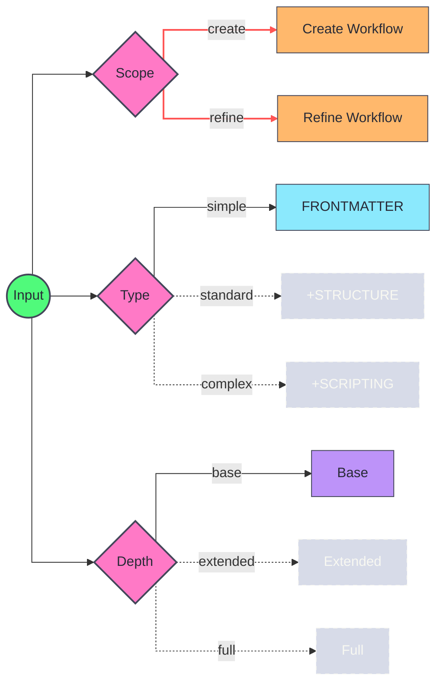
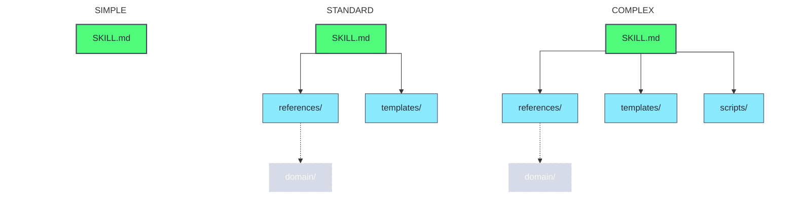

# [H1][SKILL-BUILDER]
>**Dictum:** *Structured authoring produces discoverable, maintainable skills.*

 

Universal skill creation and refinement for monorepo skills.

**Scope:** 
- *Create:* New skill from requirements. Invoke deep-research, plan structure, author SKILL.md.
- *Refine:* Existing skill refactoring. Audit structure, research gaps, refactor content.

**Domain Navigation:** 
- *[FRONTMATTER]* — Discovery metadata, trigger optimization. Load for name/description authoring, trigger patterns.
- *[STRUCTURE]* — Folder layouts, type gates. Load for type selection, folder organization.
- *[DEPTH]* — LOC limits, nesting rights. Load for LOC enforcement, nesting validation.
- *[TEMPLATES]* — Canonical output scaffolds. Load for scaffold selection, artifact generation.
- *[SCRIPTING]* — Python/TypeScript automation. Load for script standards, validation automation.

[REFERENCE]: [→index.md](./index.md) — Complete reference file listing.

---
## [2][INSTRUCTIONS]
>**Dictum:** *Progressive disclosure optimizes context loading.*

 

**Instruction Structure:** 
- *Required Task* — Mandatory read before domain work. Numbered, sequential.
- *Conditional Task* — Execute when section matches selected parameters.
- *References* — Supplemental files for deeper context. Load when needed.
- *Guidance* — Core concepts with rationale. Why > what.
- *Best-Practices* — Critical rules, patterns, constraints.

**Task Adherence:** 
1. Complete **Universal Tasks** first—applies to all workflows.
2. Complete **Required Tasks** for each domain section.
3. Complete **Conditional Tasks** when section matches selected parameters.

**Universal Tasks:** 
1. Read [→index.md](./index.md): Reference file listing for navigation.

---
## [3][DECISION]
>**Dictum:** *Three parameters gate all skill authoring.*

 

[IMPORTANT] Collect all parameters before loading domain sections. Parameters are orthogonal—each gates independent concerns.

 

 

**Conditional Task:** 
1. (Requires: create) Read [→create.md](./references/workflows/create.md): Creation workflow phases.
2. (Requires: refine) Read [→refine.md](./references/workflows/refine.md): Refinement workflow phases.

**Guidance:** 
- `Type` — Controls breadth. See §STRUCTURE for folder layout implications.
- `Depth` — Controls comprehensiveness. See §DEPTH for LOC limits and nesting rules.

[VERIFY] User must state:
- [ ] Scope: create | refine.
- [ ] Type: simple | standard | complex.
- [ ] Depth: base | extended | full.

---
## [4][STRUCTURE]
>**Dictum:** *Type determines breadth.*

 

 

**Required Task:** 
1. Read [→structure.md](./references/structure.md): Type impact, folder purpose, naming, organization.

**Guidance:** 
- `Breadth` — Type controls coverage width. Simple = focused, Standard = moderate, Complex = comprehensive.
- `Naming` — Folder name matches frontmatter `name` field. Consistency enables discovery.
- `Type Selection` — User specifies type explicitly. Prohibit assumptions and inference.

**Best-Practices:** 
- **Directory Purpose** — references/ for domain knowledge, templates/ for output scaffolds, scripts/ for automation.
- **Index Requirement** — Standard/Complex types require index.md at skill root. Lists all reference files.
- **Upgrade Path** — Start with simplest type satisfying requirements. Upgrade during refinement if scope expands.

---
## [5][DEPTH]
>**Dictum:** *Depth determines comprehensiveness.*

 

Depth prevents bloat through hard caps. Each level adds fixed increments: +50 LOC to SKILL.md, +25 LOC to other files (cumulative).

**Required Task:** 
1. Read [→depth.md](./references/depth.md): Full constraint tables, section gates, validation checklist.

**Guidance:** 
- `Mechanism` — Base enforces hard limits. Extended/Full add +50/+25 cumulative (<400/<200).
- `Nesting Gate` — Base = flat only. Extended = 1 subfolder. Full = 1-3 subfolders.
- `Section Gate` — Base: Tasks/References only. Extended: +Guidance, sparse Best-Practices. Full: comprehensive.
- `Baseline Limits` — SKILL.md <300 LOC, reference files <150 LOC at Base depth.

**Best-Practices:** 
- **Depth Selection** — Base for focused skills. Extended for moderate coverage. Full for comprehensive.
- **Core Domain** — Identify most essential domain before Extended (becomes subfolder).
- **Hard Caps** — Exceeding limits requires refactoring, not justification. No exceptions.

---
## [6][FRONTMATTER]
>**Dictum:** *Metadata enables discovery before loading.*

 

Frontmatter indexing occurs at session start for discovery table construction. Description is the ONLY field parsed for relevance matching—quality determines invocation accuracy.

**Required Task:** 
1. Read [→frontmatter.md](./references/frontmatter.md): Schema fields, trigger patterns, validation checklist.

**Guidance:** 
- `Discovery` — Discovery uses LLM reasoning only. No embeddings, no keyword matching. Description text determines relevance during forward pass.
- `Token Budget` — Only ~100 tokens loaded at startup. Conciseness maximizes discovery signal per token.
- `Optimization Target` — Description is the sole trigger mechanism. Every word must aid intent matching.
- `Failure Mode` — Poor descriptions prevent discovery. Matching failure blocks invocation.

**Best-Practices:** 
- **Length** — 1-2 sentences. Concise triggers outperform verbose explanations.
- **Voice** — [CRITICAL] Third person, active voice, present tense. Prohibited: 'could', 'might', 'probably', 'should'.
- **Signal Density** — Maximize matching surface: file types, operations, "Use when" clauses, catch-all phrases.

---
## [7][SCRIPTING]
>**Dictum:** *Deterministic automation extends LLM capabilities.*

 

Complex type enables scripts/ folder. Downstream skills execute automation for external tool orchestration, artifact generation, validation.

**Conditional Task:** 
1. (Requires: complex) Read [→scripting.md](./references/scripting.md): Standards, patterns, quality gate.

**Guidance:** 
- `Complex Justification` — Script overhead demands explicit need: external tool wrapping, exact reproducibility, schema enforcement.
- `Downstream Value` — Skills with scripts provide CLI tooling, deterministic generation, validation beyond LLM generation.
- `Depth Scaling` — Base/Extended: single script. Full: multiple scripts when distinct concerns justify separation.

**Best-Practices:** 
- **Type Selection** — Standard suffices for most skills. Choose complex only when deterministic automation is core to skill purpose.
- **Augmentation** — Scripts support skill workflows. Core logic remains in SKILL.md and references.
- **Pattern Delegation** — Criteria, tooling versions, code patterns, and quality gate defined in scripting.md.

---
## [8][TEMPLATES]
>**Dictum:** *Templates enforce canonical structure.*

 

Skill templates define scaffolds for generated artifacts. Agent combines user input with template structure to produce consistent outputs. Standard/Complex types only.

**References:** 
- [→simple.skill.template.md](./templates/simple.skill.template.md): Single-file skill scaffold.
- [→standard.skill.template.md](./templates/standard.skill.template.md): Multi-file skill with references/, templates/.
- [→complex.skill.template.md](./templates/complex.skill.template.md): Full skill with scripts/ automation.

**Guidance:** 
- `Purpose` — Templates define canonical output structure. Follow template exactly. No improvisation.
- `Composition` — Input data + template skeleton = generated artifact. Templates encode structural decisions.
- `Canonical Form` — Base/Extended depth: single template per output type. Full depth: variations permitted.

**Best-Practices:** 
- **Placeholder Syntax** — Use `${variable-name}` for insertion points. Document required vs optional fields.
- **Structure Match** — Template complexity matches depth selection. Base templates are minimal; Full templates are comprehensive.
