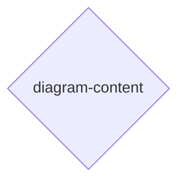

# [H1][${NAME}]
>**Dictum:** *${core-truth-one-sentence}.*

 

${one-sentence-purpose}

**Scope:** 
- *${Mode-1}:* ${workflow-description}.
- *${Mode-N}:* ${workflow-description}.

**Domain Navigation:** 
- *[${DOMAIN}]* — ${domain-summary}. Load for: ${when-to-load}.
- *[${DOMAIN}]* — ${domain-summary}. Load for: ${when-to-load}.
- *[SCRIPTING]* — Automation scripts. Load for: ${automation-trigger}.

[REFERENCE]: [→index.md](./index.md) — Reference file listing.

---
## [2][INSTRUCTIONS]
>**Dictum:** *Progressive disclosure optimizes context loading.*

 

**Instruction Structure:** 
- *Required Task* — Mandatory read before domain work.
- *Conditional Task* — Applies when parameter matches.
- *Guidance* — Core concepts with rationale.
- *Best-Practices* — Constraints and patterns.

**Universal Tasks:** 
1. Read [→index.md](./index.md): Reference file listing for navigation.

---
## [3][DECISION]
>**Dictum:** *${decision-principle}.*

 

[IMPORTANT] ${parameter-collection-context}.

**Conditional Task:** 
1. (Requires: ${scope-1}) Read [→${workflow-1}.md](./references/workflows/${workflow-1}.md): ${workflow-details}.
2. (Requires: ${scope-N}) Read [→${workflow-N}.md](./references/workflows/${workflow-N}.md): ${workflow-details}.

[VERIFY] Parameters collected:
- [ ] ${parameter-1}: ${options}.
- [ ] ${parameter-N}: ${options}.

---
## [N][${DOMAIN}]
>**Dictum:** *${domain-truth}.*

 

${domain-context-sentence}

**Required Task:** 
1. Read [→${domain}.md](./references/${domain}.md): ${what-file-contains}.

**Conditional Task:** 
1. (Requires: ${condition}) Read [→${file}.md](./references/${file}.md): ${context}.

**Guidance:** 
- `${Concept}` — ${why-it-matters}.

**Best-Practices:** 
- **${Pattern}** — ${constraint-or-rule}.

---
## [N+1][SCRIPTING]
>**Dictum:** *Scripts extend capabilities beyond LLM generation.*

 

**Conditional Task:** 
1. (Requires: automation needed) Read [→scripting.md](./references/scripting.md): Standards and patterns.

**Guidance:** 
- `${Concept}` — ${why-it-matters}.

**Best-Practices:** 
- **${Pattern}** — ${constraint-or-rule}.
