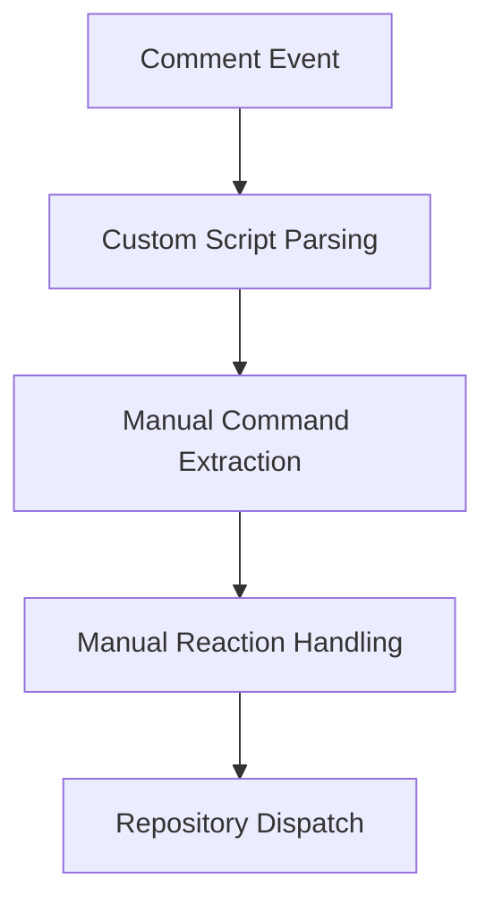
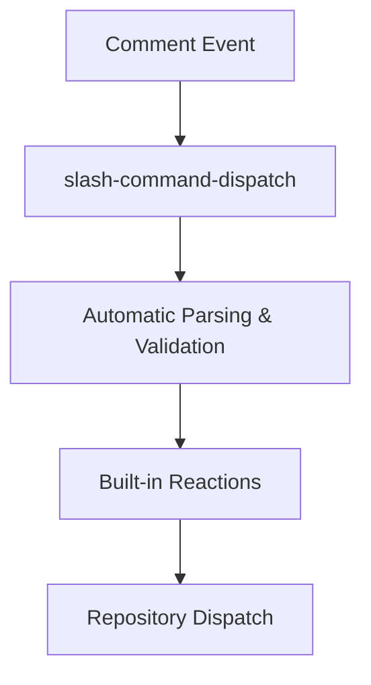

# Workflow Optimization Summary

## Overview

This document summarizes the GitHub Actions workflow optimizations implemented to better integrate marketplace actions and reduce handrolled logic.

## Changes Implemented

### 1. Updated Changed Files Detection (`tj-actions/changed-files@v47`)

**Previous**: `step-security/changed-files@v4.3.0`  
**Current**: `tj-actions/changed-files@v47`

**Benefits**:
- Latest version with improved performance (0-10 seconds execution)
- Enhanced JSON output format optimized for matrix jobs
- Better support for monorepos and merge queues
- More comprehensive file status tracking (ACMRDTUX)
- Improved security with safe output handling

**Files Modified**:
- `.github/actions/changed-detection/action.yml`
- `.github/scripts/schema.ts` (B.changes.action)

**Configuration**:
```yaml
uses: tj-actions/changed-files@24d32ffd492484c1d75e0c0b894501ddb9d30d62 # v47
with:
  files: ${{ inputs.files_pattern || '**' }}
  json: true
  write_output_files: false
```

### 2. Integrated Slash Command Dispatch (`peter-evans/slash-command-dispatch@v4`)

**New**: Centralized slash command handling with marketplace action

**Benefits**:
- Standardized command parsing and dispatch
- Built-in permission checking
- Automatic reaction management (👀 seen, 🚀 dispatched)
- Support for both repository_dispatch and workflow_dispatch
- Named and unnamed argument parsing

**Files Created**:
- `.github/actions/slash-dispatch/action.yml` - New composite action wrapper

**Files Modified**:
- `.github/workflows/gemini-dispatch.yml` - Uses slash-dispatch for commands
- `.github/workflows/active-qc.yml` - Uses slash-dispatch for /duplicate command
- `.github/scripts/schema.ts` (B.slashDispatch)

**Configuration**:
```yaml
uses: ./.github/actions/slash-dispatch
with:
  token: ${{ secrets.GITHUB_TOKEN }}
  commands: |
    review
    triage
    architect
    implement
    invoke
  permission: write
  reactions: 'true'
```

### 3. Verified pnpm Setup (`pnpm/action-setup@v4.1.0`)

**Status**: Already at latest version - No changes needed

**Current Configuration**:
- Location: `.github/actions/node-env/action.yml`
- Version: v4.1.0 (latest as of December 2024)
- Features: Automatic version detection from packageManager field
- Caching: Integrated with actions/setup-node cache

## Architecture Improvements

### Before


### After


## B Constant Updates

Added `slashDispatch` section to centralized configuration:

```typescript
slashDispatch: {
    action: {
        name: 'peter-evans/slash-command-dispatch',
        ref: 'a28ee6cd74d5200f99e247ebc7b365c03ae0ef3c',
        version: '4.0.1',
    } as const,
    commands: {
        gemini: ['review', 'triage', 'architect', 'implement', 'invoke'] as const,
        maintenance: ['duplicate'] as const,
    } as const,
    eventSuffix: '-command' as const,
    permission: 'write' as const,
    reactions: { dispatch: '🚀', seen: '👀' } as const,
} as const,
```

## Testing & Validation

### Performed Checks
- ✅ YAML syntax validation (all workflows)
- ✅ Biome linting and formatting
- ✅ TypeScript compilation
- ✅ Key sorting in B constant (alphabetical)

### CI Integration
All changes integrate with existing CI pipeline:
- Nx affected commands work with new changed-files output
- Slash commands maintain backward compatibility
- No breaking changes to existing workflows

## Future Opportunities

1. **Additional Slash Commands**: Extend `/duplicate` pattern to other operations
2. **Workflow Dispatch Integration**: Use `dispatch-type: workflow_dispatch` for direct workflow invocation
3. **Command Analytics**: Track command usage via repository dispatch events
4. **Matrix Jobs**: Leverage changed-files matrix output for parallel execution

## References

- [tj-actions/changed-files](https://github.com/tj-actions/changed-files)
- [peter-evans/slash-command-dispatch](https://github.com/peter-evans/slash-command-dispatch)
- [pnpm/action-setup](https://github.com/pnpm/action-setup)

## Rollback Instructions

If issues arise, revert to previous versions:

```yaml
# Changed Files
uses: step-security/changed-files@f9b3bb1f9126ed32d88ef4aacec02bde4b70daa2 # v4.3.0

# Remove slash-dispatch usage
# Restore manual command parsing in gemini-dispatch.yml
```

## Maintenance

- **Update Frequency**: Check for new marketplace action versions quarterly
- **Security**: Pin to commit SHAs for supply chain security
- **Documentation**: Update B constant when versions change
