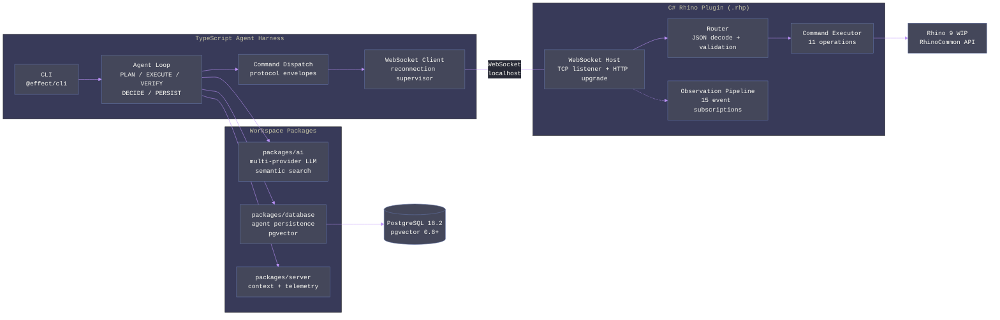
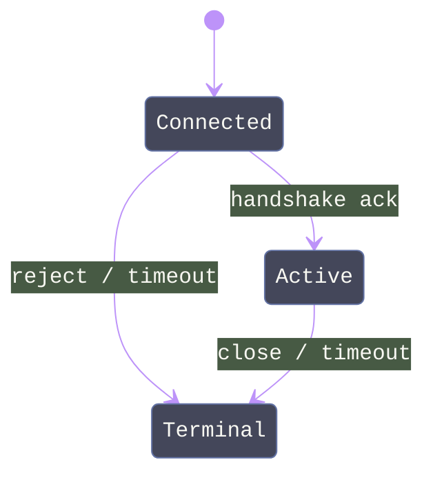
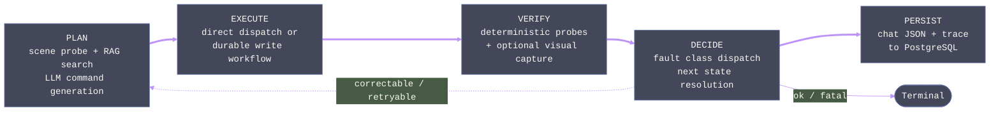

# Kargadan

A CLI-based AI agent that controls Rhino 9 through natural language. Two-process architecture -- TypeScript agent harness (out-of-process) communicating with a C# Rhino plugin (in-process) over localhost WebSocket -- is the only viable path on macOS where Rhino.Inside and Rhino.Compute are unavailable. The user types intent in a terminal, the agent discovers relevant Rhino commands via RAG-backed semantic search, executes them through the plugin, verifies results deterministically and visually, and maintains persistent context across sessions.

## Quick Start

**Prerequisites**: macOS Sequoia 15+ (Apple Silicon), Rhino 9 WIP, Node.js 22+, pnpm 9+, PostgreSQL 18.2+ (with pgvector 0.8+)

**1. Install dependencies**

```bash
pnpm install
```

**2. Configure environment**

```bash
export KARGADAN_CHECKPOINT_DATABASE_URL="postgresql://localhost:5432/kargadan"
export ANTHROPIC_API_KEY="sk-ant-..."    # or OPENAI_API_KEY / GEMINI_API_KEY
```

**3. Load the plugin in Rhino 9**

Build the plugin, then load `ParametricPortal.Kargadan.Plugin.rhp` via Rhino's PlugInManager. The plugin writes a port file to `~/.kargadan/port` on startup.

**4. Run the agent**

```bash
# Interactive mode with natural language intent
pnpm exec nx run kargadan-harness:cli -- run -i "Create a 10x10 box"

# Resume latest session
pnpm exec nx run kargadan-harness:cli -- run --resume auto

# List past sessions
pnpm exec nx run kargadan-harness:cli -- sessions list

# Export session trace
pnpm exec nx run kargadan-harness:cli -- sessions export --session-id <uuid> --format ndjson
```

---

## Architecture



| Component            | Responsibility                                                                                                                                           |
| -------------------- | -------------------------------------------------------------------------------------------------------------------------------------------------------- |
| Harness (`harness/`) | Agent loop orchestration, CLI interface, WebSocket client, session persistence, context compaction, AI provider management                               |
| Plugin (`plugin/`)   | WebSocket server inside Rhino, command execution (RunScript + direct API), event observation pipeline, undo integration, protocol contracts              |
| packages/ai          | Multi-provider LLM abstraction (Anthropic/OpenAI/Gemini), embedding, semantic search via reciprocal rank fusion, toolkit composition, budget enforcement |
| packages/database    | Polymorphic repo factory, pgvector search, Model.Class definitions, tenant scoping, keyset pagination, agent persistence service                         |
| packages/server      | Context propagation (FiberRef-backed), telemetry (OTLP), metrics, cache (Redis), resilience patterns                                                     |

---

## Harness

The TypeScript harness is the out-of-process agent runtime. It connects to the Rhino plugin over WebSocket, drives the AI agent loop, and persists all state to PostgreSQL.

### Modules

| Module                  | Purpose                                                                                        | Key Exports                                      |
| ----------------------- | ---------------------------------------------------------------------------------------------- | ------------------------------------------------ |
| `cli.ts`                | `@effect/cli` command graph with 6 commands across `run`, `sessions`, and `diagnostics` groups | Entry point via `NodeRuntime.runMain()`          |
| `config.ts`             | All environment variables decoded via Effect Config; persistence layer composition             | `HarnessConfig`, `decodeOverride`                |
| `harness.ts`            | Session lifecycle: connect, handshake, seed knowledge base, run agent loop, persist            | `runHarness`                                     |
| `socket.ts`             | WebSocket transport with pending-request tracking and staleness detection                      | `KargadanSocketClient`, `ReconnectionSupervisor` |
| `protocol/schemas.ts`   | Envelope union schema (10 variants), catalog entry schema, failure classification              | `Envelope`, `CatalogEntrySchema`                 |
| `protocol/dispatch.ts`  | Handshake negotiation, command round-trip, heartbeat                                           | `CommandDispatch`                                |
| `runtime/agent-loop.ts` | Five-stage state machine with durable workflow integration for write operations                | `AgentLoop`                                      |

### CLI Commands

**`kargadan run`** -- Interactive agent execution.

| Option             | Flag                       | Description                             |
| ------------------ | -------------------------- | --------------------------------------- |
| Intent             | `-i, --intent`             | Natural language goal                   |
| Session ID         | `-s, --session-id`         | Explicit session UUID                   |
| Resume             | `-r, --resume`             | `auto` (find latest resumable) or `off` |
| Architect model    | `-m, --architect-model`    | Override planning model                 |
| Architect provider | `-p, --architect-provider` | Override planning provider              |
| Architect fallback | `--architect-fallback`     | Repeatable fallback providers           |

**`kargadan sessions`** -- Session management.

| Subcommand | Description                                                                  |
| ---------- | ---------------------------------------------------------------------------- |
| `list`     | Paginated session listing with status filter                                 |
| `trace`    | Tool-call timeline for a session (sequence, operation, status, failureClass) |
| `resume`   | Resume by session ID or latest resumable                                     |
| `export`   | Export trace as NDJSON or CSV                                                |

**`kargadan diagnostics check`** -- Validate environment, DB connectivity, transport preconditions.

### Connection Flow

1. Read `~/.kargadan/port` JSON (pid, port, startedAt)
2. Verify process alive, connect `ws://127.0.0.1:{port}`
3. `ReconnectionSupervisor` retries with exponential backoff (500ms base, 30s max, 50 attempts)
4. `CommandDispatch.handshake()` sends `handshake.init` with capabilities and protocol version
5. Receives `handshake.ack` with accepted capabilities and command catalog
6. Merges handshake catalog with environment manifest override (environment takes precedence, deduplicated by entry ID)
7. Seeds knowledge base via `AiService.seedKnowledge(catalog)` (SHA256 hash-guarded to prevent redundant seeding)

### Layer Composition

```
KargadanSocketClientLive           -- WebSocket transport
  + CommandDispatch.Default        -- Protocol dispatch
  + AgentLoop.Default              -- Agent state machine
  + ReconnectionSupervisor.Default
  + AiService.KnowledgeDefault     -- AI + knowledge base
  + HarnessConfig.persistenceLayer -- PostgreSQL checkpoint DB
```

---

## Plugin

The C# plugin runs inside Rhino 9 as a `.rhp` assembly targeting `net9.0`. It hosts a WebSocket server on localhost, executes commands against RhinoDoc, observes document changes, and manages undo integration.

### Modules

| Directory      | Key Types                                                                | Responsibility                                                                                                                                                                           |
| -------------- | ------------------------------------------------------------------------ | ---------------------------------------------------------------------------------------------------------------------------------------------------------------------------------------- |
| `boundary/`    | `KargadanPlugin`, `EventPublisher`, `SessionEventPublisher`              | Plugin lifecycle, message dispatch, UI thread marshaling via `RhinoApp.InvokeOnUiThread`, lock-free event queue via `Ref<Seq<T>>`                                                        |
| `contracts/`   | 13 smart enums, 12+ value objects, 6 envelope types, `Require` validator | Protocol type system: `ErrorCode` with computed `FailureClass`, `CommandOperation` with `ExecutionMode`/`Category`, Thinktecture `[ValueObject<T>]` with `SearchValues<char>` validation |
| `execution/`   | `CommandExecutor` (static, 11 routes)                                    | Command handlers (7 read, 3 write, 1 script) with undo wrapping via `BeginUndoRecord`/`EndUndoRecord`                                                                                    |
| `observation/` | `ObservationPipeline`                                                    | 15 RhinoDoc event subscriptions, bounded channel (256, DropOldest), 200ms debounce timer, batch aggregation                                                                              |
| `protocol/`    | `CommandRouter`, `FailureMapping`                                        | Monadic JSON decoding via LanguageExt `from...select`, exception-to-`ErrorCode` mapping                                                                                                  |
| `transport/`   | `WebSocketHost`, `SessionHost`, `WebSocketPortFile`                      | TCP listener, HTTP upgrade, `Lock`-gated session state machine, semaphore-gated sends, atomic port file I/O                                                                              |

### Command Catalog

11 operations exported via handshake acknowledgment:

| Operation              | Category  | Mode       | Undo |
| ---------------------- | --------- | ---------- | ---- |
| `read.scene.summary`   | Read      | Direct API | No   |
| `read.object.metadata` | Read      | Direct API | No   |
| `read.object.geometry` | Read      | Direct API | No   |
| `read.layer.state`     | Read      | Direct API | No   |
| `read.view.state`      | Read      | Direct API | No   |
| `read.tolerance.units` | Read      | Direct API | No   |
| `view.capture`         | Read      | Direct API | No   |
| `write.object.create`  | Write     | Direct API | Yes  |
| `write.object.update`  | Write     | Direct API | Yes  |
| `write.object.delete`  | Write     | Direct API | Yes  |
| `script.run`           | Geometric | Script     | No   |

Write operations wrap in `BeginUndoRecord`/`EndUndoRecord` with `AddCustomUndoEvent` for agent state tracking. Pressing Cmd+Z undoes the entire AI action atomically. Failure auto-reverts via `doc.Undo()`.

### Event Observation

15 RhinoDoc events subscribed (AddRhinoObject, DeleteRhinoObject, UndeleteRhinoObject, ReplaceRhinoObject, ModifyObjectAttributes, SelectObjects, DeselectObjects, DeselectAllObjects, LayerTableEvent, MaterialTableEvent, DimensionStyleTableEvent, InstanceDefinitionTableEvent, LightTableEvent, GroupTableEvent, DocumentPropertiesChanged). Events are buffered in a bounded channel (capacity 256, DropOldest), debounced at 200ms, then flushed as `stream.compacted` batch envelopes with category breakdowns. Undo/redo tracked separately via `Command.UndoRedo` event.

### Thread Safety

| Mechanism                   | Location              | Purpose                                                                 |
| --------------------------- | --------------------- | ----------------------------------------------------------------------- |
| `RhinoApp.InvokeOnUiThread` | `KargadanPlugin`      | Marshal document mutations from WebSocket handler to AppKit main thread |
| `Lock` (C# 13)              | `SessionHost`         | Serialize all session state transitions under `Lock.Scope`              |
| `SemaphoreSlim(1,1)`        | `WebSocketHost`       | Serialize WebSocket write frames (not natively thread-safe)             |
| `Atom<Option<T>>`           | `KargadanPlugin`      | Atomic plugin state reference (lock-free)                               |
| `Ref<Seq<T>>`               | `EventPublisher`      | Lock-free immutable event queue via atomic swap                         |
| `Channel<T>`                | `ObservationPipeline` | Single-reader bounded channel for event buffering                       |

### Session State Machine



Handshake negotiation validates: auth token expiry, protocol version compatibility (major must match), and capability intersection. Idempotency enforcement uses a ring-buffer LRU (capacity 1024) keyed on `(idempotencyKey, payloadHash, operation)`.

---

## Wire Protocol

All messages are JSON objects with a `_tag` discriminator field.

### Envelope Types

| Tag                | Direction         | Purpose                                                                                      |
| ------------------ | ----------------- | -------------------------------------------------------------------------------------------- |
| `handshake.init`   | Harness -> Plugin | Authentication, capabilities, protocol version                                               |
| `handshake.ack`    | Plugin -> Harness | Accepted capabilities, server info, command catalog                                          |
| `handshake.reject` | Plugin -> Harness | Negotiation failure with reason                                                              |
| `command`          | Harness -> Plugin | Tool invocation with args, objectRefs, idempotency, undoScope                                |
| `command.ack`      | Plugin -> Harness | Receipt acknowledgment (not final result)                                                    |
| `result`           | Plugin -> Harness | Execution result with status, dedupe info, execution metadata                                |
| `event`            | Plugin -> Harness | Document change notification (7 subtypes + undo.redo + session.lifecycle + stream.compacted) |
| `heartbeat`        | Bidirectional     | Ping/pong for staleness detection                                                            |
| `error`            | Plugin -> Harness | Remote error notification                                                                    |

### Identity Context

Every envelope carries:

```typescript
{
  appId: UUID,              // Tenant ID
  correlationId: string,    // Trace ID (hex 8-64)
  requestId: UUID,          // Request ID
  sessionId: UUID           // Session ID
}
```

### Telemetry Context

Commands include tracing metadata for distributed observability:

```typescript
{
  traceId: string,          // Hex 8-64 chars
  spanId: string,           // Hex 8-64 chars
  operationTag: string,     // Operation label
  attempt: number           // >= 1
}
```

### Failure Classification

Errors carry a `failureClass` discriminator that drives the agent's DECIDE stage:

| Class           | Meaning                 | Agent Response     |
| --------------- | ----------------------- | ------------------ |
| `retryable`     | Transient (timeout, IO) | Retry with backoff |
| `correctable`   | Wrong parameters        | Adjust and retry   |
| `compensatable` | Partial write           | Undo scope + rerun |
| `fatal`         | Protocol/transport      | Stop               |

---

## Agent Loop

The core loop in `AgentLoop` implements a five-stage state machine driven by `AiService.runAgentCore()`:



**PLAN**: Probes scene summary, searches knowledge base via pgvector cosine similarity, builds prompt with catalog candidates, generates structured command via LLM (`generateObject` with typed schema). Context compaction triggers at 75% token budget, targeting 40% reduction via LLM-driven history summarization.

**EXECUTE**: Branches by operation kind. Read/script operations dispatch directly. Write operations execute through `@effect/workflow` with a durable deferred approval gate -- the `onWriteApproval` hook fires, the workflow waits for explicit approval, then executes with 2 retries and compensation (undo) on failure.

**VERIFY**: Gathers deterministic evidence (scene summary probe, object metadata probe). Optionally captures visual evidence via `view.capture` (1600x900 PNG) processed by AI for confidence scoring. Deterministic checks are the pass/fail authority; visual evidence only augments confidence.

**DECIDE**: Maps verification result to next state. Success terminates. Correctable faults re-enter PLAN with adjusted constraints. Retryable faults increment attempt counter. Exhausted retries or fatal errors terminate with failure.

**PERSIST**: Serializes chat JSON via `@effect/ai` `Chat.exportJson`/`Chat.fromJson` and writes trace entry to PostgreSQL via `AgentPersistenceService.persistCall()`. Enables session resumption and audit trail replay.

### Lifecycle Hooks

The agent loop exposes four hooks for CLI integration:

| Hook              | Signature                                             | Purpose                     |
| ----------------- | ----------------------------------------------------- | --------------------------- |
| `onStage`         | `(stage, phase, attempt, sequence, status)`           | Stage transition visibility |
| `onTool`          | `(command, phase, source, result, durationMs)`        | Tool call streaming         |
| `onFailure`       | `(commandId, failureClass, message, advice)`          | Error communication         |
| `onWriteApproval` | `(command, sequence, workflowExecutionId) => boolean` | Plan-before-execute gate    |

### Observation Masking

Scene observation payloads are sanitized before inclusion in LLM context to control token budget:
- **Excluded keys**: `brep`, `breps`, `edges`, `faces`, `geometry`, `mesh`, `meshes`, `nurbs`, `points`, `vertices`
- **String truncation**: 280 characters
- **Array depth**: 2 levels, 12 items max
- **Object depth**: 3 levels, 24 fields max

---

## Package Dependencies

Kargadan imports from three workspace packages. Each section lists the specific modules consumed and what they provide.

### packages/ai

| Import Path                      | Consumed By                          | Provides                                                                  |
| -------------------------------- | ------------------------------------ | ------------------------------------------------------------------------- |
| `@parametric-portal/ai/service`  | agent-loop.ts, harness.ts            | `AiService` (seedKnowledge, searchQuery, buildAgentToolkit, runAgentCore) |
| `@parametric-portal/ai/registry` | config.ts, agent-loop.ts, harness.ts | `AiRegistry` (provider/model session override via FiberRef)               |

Multi-provider language model abstraction (Anthropic, OpenAI, Gemini) with per-tenant budget/rate enforcement. Provider fallback chains attempt each configured fallback on `AiSdkError`. Embedding via OpenAI with batched/data-loader modes. Semantic search fuses ranking strategies (FTS, trigram, phonetic, vector similarity) via reciprocal rank fusion. Tool definitions via `Tool.make` with typed success/failure schemas. Generic agent core (`runAgentCore`) accepts caller-defined stage functions and iterates until terminal state. Chat serialization via `@effect/ai` `Chat.exportJson`/`Chat.fromJson` for checkpoint roundtrip.

### packages/database

| Module              | Files                                        | Exports                                                                        |
| ------------------- | -------------------------------------------- | ------------------------------------------------------------------------------ |
| `agent-persistence` | cli.ts, config.ts, harness.ts, agent-loop.ts | `AgentPersistenceService`, `AgentPersistenceLayer` (session/call/trace/resume) |
| `client`            | config.ts, harness.ts                        | `Client.tenant.Id.system` (system tenant UUID)                                 |
| `repos`             | harness.ts                                   | `DatabaseService` (polymorphic repo composition root)                          |

`AgentPersistenceService` manages the `agent_journal` table with entry kinds: `session_start`, `tool_call`, `checkpoint`, `session_complete`. Session hydration restores `chatJson`, `loopState`, and `sequence` for resumption (with divergence detection). The polymorphic repo factory provides `find`, `one`, `put`, `set`, `upsert`, `merge`, `page`, `stream` with tenant scoping, OCC, soft-delete, and keyset pagination. pgvector support via `HALFVEC(3072)` with HNSW indexing powers the knowledge base semantic search.

### packages/server

| Module              | Files              | Exports                                                               |
| ------------------- | ------------------ | --------------------------------------------------------------------- |
| `context`           | cli.ts, harness.ts | `Context.Request` (FiberRef tenant/session scoping)                   |
| `observe/telemetry` | agent-loop.ts      | `Telemetry` (OTLP span wrapping with auto SpanKind, diagnostics emit) |

`Context.Request` provides tenant isolation via FiberRef. Telemetry auto-injects request context attributes into OTLP spans with SpanKind inference from prefix (`kargadan.*` -> INTERNAL). CacheService (Redis) provides rate limiting and idempotency caching consumed transitively by the AI budget enforcement layer.

---

## Configuration Reference

All environment variables are decoded in `harness/src/config.ts` via Effect Config.

### Core

| Variable                           | Default                                                      | Description                                          |
| ---------------------------------- | ------------------------------------------------------------ | ---------------------------------------------------- |
| `KARGADAN_CHECKPOINT_DATABASE_URL` | (required)                                                   | PostgreSQL connection string for session persistence |
| `KARGADAN_AGENT_INTENT`            | "Summarize the active scene and apply the requested change." | Default natural language goal                        |
| `KARGADAN_APP_ID`                  | System UUID                                                  | Tenant ID for multi-tenancy                          |
| `KARGADAN_SESSION_TOKEN`           | "kargadan-local-token"                                       | Auth token for plugin handshake                      |
| `KARGADAN_PROTOCOL_VERSION`        | "1.0"                                                        | Handshake protocol version                           |

### Transport

| Variable                             | Default | Description              |
| ------------------------------------ | ------- | ------------------------ |
| `KARGADAN_COMMAND_DEADLINE_MS`       | 5000    | Timeout per command (ms) |
| `KARGADAN_HEARTBEAT_INTERVAL_MS`     | 5000    | Heartbeat frequency (ms) |
| `KARGADAN_HEARTBEAT_TIMEOUT_MS`      | 15000   | Staleness threshold (ms) |
| `KARGADAN_RECONNECT_MAX_ATTEMPTS`    | 50      | Port discovery retries   |
| `KARGADAN_RECONNECT_BACKOFF_BASE_MS` | 500     | Exponential backoff base |
| `KARGADAN_RECONNECT_BACKOFF_MAX_MS`  | 30000   | Max backoff duration     |

### Agent Loop

| Variable                                      | Default | Description                          |
| --------------------------------------------- | ------- | ------------------------------------ |
| `KARGADAN_RETRY_MAX_ATTEMPTS`                 | 5       | Retryable fault max attempts         |
| `KARGADAN_CORRECTION_MAX_CYCLES`              | 1       | Correctable fault max cycles         |
| `KARGADAN_CONTEXT_COMPACTION_TRIGGER_PERCENT` | 75      | Trigger compaction at % of maxTokens |
| `KARGADAN_CONTEXT_COMPACTION_TARGET_PERCENT`  | 40      | Target compaction to % of maxTokens  |

### AI Provider

| Variable                         | Default                       | Description                                  |
| -------------------------------- | ----------------------------- | -------------------------------------------- |
| `KARGADAN_AI_LANGUAGE_MODEL`     | (inherit)                     | Language model override                      |
| `KARGADAN_AI_LANGUAGE_PROVIDER`  | (inherit)                     | Language provider override                   |
| `KARGADAN_AI_LANGUAGE_FALLBACK`  | (empty)                       | Comma-separated fallback providers           |
| `KARGADAN_AI_ARCHITECT_MODEL`    | (inherit)                     | Architect planning model override            |
| `KARGADAN_AI_ARCHITECT_PROVIDER` | (inherit)                     | Architect provider override                  |
| `KARGADAN_AI_ARCHITECT_FALLBACK` | (empty)                       | Comma-separated architect fallback providers |
| `ANTHROPIC_API_KEY`              | (required if using Anthropic) | Anthropic API key                            |
| `OPENAI_API_KEY`                 | (required if using OpenAI)    | OpenAI API key                               |
| `GEMINI_API_KEY`                 | (required if using Gemini)    | Google Gemini API key                        |

### Knowledge Base

| Variable                                | Default    | Description                          |
| --------------------------------------- | ---------- | ------------------------------------ |
| `KARGADAN_COMMAND_MANIFEST_JSON`        | (empty)    | JSON override for command catalog    |
| `KARGADAN_COMMAND_MANIFEST_VERSION`     | (empty)    | Manifest version string              |
| `KARGADAN_COMMAND_MANIFEST_NAMESPACE`   | "kargadan" | Knowledge base namespace             |
| `KARGADAN_COMMAND_MANIFEST_ENTITY_TYPE` | "command"  | Knowledge base entity type           |
| `KARGADAN_COMMAND_MANIFEST_SCOPE_ID`    | (empty)    | Knowledge base scope UUID (optional) |

### Capabilities

| Variable                   | Default                                    | Description                            |
| -------------------------- | ------------------------------------------ | -------------------------------------- |
| `KARGADAN_CAP_REQUIRED`    | "read.scene.summary,write.object.create"   | Required capability negotiation        |
| `KARGADAN_CAP_OPTIONAL`    | "view.capture"                             | Optional capabilities                  |
| `KARGADAN_LOOP_OPERATIONS` | "read.object.metadata,write.object.update" | Comma-separated fallback operation IDs |

### Write Object Reference

| Variable                                | Default                                | Description                                                    |
| --------------------------------------- | -------------------------------------- | -------------------------------------------------------------- |
| `KARGADAN_WRITE_OBJECT_ID`              | "00000000-0000-0000-0000-000000000100" | UUID for write commands                                        |
| `KARGADAN_WRITE_OBJECT_SOURCE_REVISION` | 0                                      | Revision for OCC                                               |
| `KARGADAN_WRITE_OBJECT_TYPE_TAG`        | "Brep"                                 | Brep, Mesh, Curve, Surface, Annotation, Instance, LayoutDetail |

### Database Connection

| Variable                      | Default | Description          |
| ----------------------------- | ------- | -------------------- |
| `KARGADAN_PG_CONNECT_TIMEOUT` | 10s     | Connection timeout   |
| `KARGADAN_PG_IDLE_TIMEOUT`    | 30s     | Idle timeout         |
| `KARGADAN_PG_MAX_CONNECTIONS` | 5       | Connection pool size |

---

## Technology Stack

| Layer                 | Technology                                                             | Version                        |
| --------------------- | ---------------------------------------------------------------------- | ------------------------------ |
| **Runtime (Harness)** | TypeScript, Effect                                                     | 6.0+, 3.19+                    |
| **Runtime (Plugin)**  | C#, .NET                                                               | 13, net9.0                     |
| **AI Providers**      | @effect/ai, @effect/ai-anthropic, @effect/ai-openai, @effect/ai-google | 0.33.2, 0.23.0, 0.37.2, 0.12.1 |
| **Workflows**         | @effect/workflow                                                       | 0.16.0                         |
| **CLI**               | @effect/cli                                                            | Latest                         |
| **Database**          | PostgreSQL + pgvector                                                  | 18.2+, 0.8+                    |
| **Search**            | pgvector HNSW, pg_trgm, fuzzystrmatch, unaccent                        | --                             |
| **C# Ecosystem**      | LanguageExt, Thinktecture                                              | 5.0.0-beta-77, 10.0.0          |
| **CAD Platform**      | Rhino 9 WIP (RhinoCommon)                                              | Apple Silicon only             |
| **Monorepo**          | Nx, pnpm workspaces                                                    | --                             |

---

## Constraints

- **macOS Apple Silicon only** -- Rhino 9 WIP dropped Intel July 2025; plugin targets `net9.0` single framework
- **Single document per session** -- Multi-document requires event ordering research specific to macOS
- **Grasshopper deferred** -- GH2 API unstable; GH1 integration remains out of scope for current phase
- **No MCP for core execution** -- MCP kept in packages/ai for interop (Claude Desktop/Cursor) but native typed tool calls are the reliability substrate
- **Thread marshaling mandatory** -- Every RhinoDoc mutation from WebSocket handler must route through `RhinoApp.InvokeOnUiThread`

## License

Proprietary. All rights reserved.
