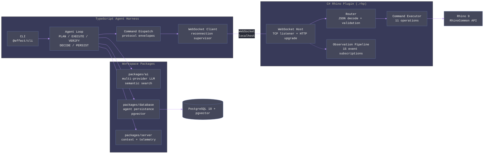
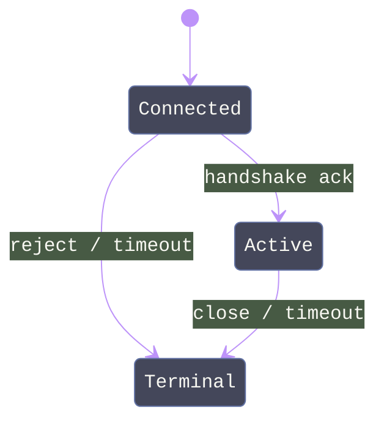

# Kargadan

A CLI-based AI agent that controls Rhino 9 through natural language. Two-process architecture -- TypeScript agent harness (out-of-process) communicating with a C# Rhino plugin (in-process) over localhost WebSocket -- is the viable macOS path where Rhino.Inside and Rhino.Compute are unavailable. The user types intent in a terminal, the agent discovers relevant Rhino commands via retrieval-backed search, executes them through the plugin, verifies results deterministically, and maintains persistent context across sessions.

## Quick Start

**Prerequisites**: macOS 15+ (Apple Silicon), Rhino 9 for Mac, Node.js 25.6.1, pnpm 10.30.1

**1. Install dependencies**

```bash
pnpm install
```

**2. Initialize Kargadan**

```bash
pnpm exec nx run @parametric-portal/kargadan-harness:cli -- init
```

The init wizard prompts for AI provider, model, and credentials. OpenAI and Anthropic use API secrets; Gemini uses a Google desktop OAuth client JSON and browser consent. Secrets and OAuth tokens are stored in the macOS Keychain, while `~/.kargadan/config.json` keeps only non-secret metadata plus the app-owned PostgreSQL URL. Kargadan bootstraps its own Postgres.app cluster under `~/.kargadan/postgres/18/` and persists `database.url` automatically.

**3. Prepare and probe the Rhino side**

```bash
pnpm exec nx run @parametric-portal/kargadan-harness:cli -- diagnostics live --prepare --launch
```

This is the preferred local loop. It builds `ParametricPortal.Kargadan.Plugin`, packages it with Yak, installs it into Rhino, launches Rhino, waits for `~/.kargadan/port`, performs a real handshake plus `read.scene.summary`, and writes a probe artifact under `~/.kargadan/live/`.

Manual plugin iteration is still available when needed:

```bash
pnpm exec nx run ParametricPortal.Kargadan.Plugin:build:release
```

**4. Run the agent**

```bash
# Bare command enters interactive agent mode (runs init wizard on first use)
pnpm exec nx run @parametric-portal/kargadan-harness:cli

# With explicit intent
pnpm exec nx run @parametric-portal/kargadan-harness:cli -- run -i "Create a 10x10 box"

# Resume latest session
pnpm exec nx run @parametric-portal/kargadan-harness:cli -- run --resume auto

# List past sessions
pnpm exec nx run @parametric-portal/kargadan-harness:cli -- sessions list

# Export session trace (--format ndjson|csv, paginated via KARGADAN_SESSION_EXPORT_LIMIT)
pnpm exec nx run @parametric-portal/kargadan-harness:cli -- sessions export --session-id <uuid> --format ndjson --output /tmp/trace.ndjson
```

**PostgreSQL requirement**: Kargadan uses one PostgreSQL 18 + `pgvector` deployment. The default product path is the app-owned Postgres.app cluster; `KARGADAN_CHECKPOINT_DATABASE_URL` remains available as a test/CI override.

**Standalone binary**: Build a self-contained executable (no Node.js required on target):

```bash
pnpm exec nx run @parametric-portal/kargadan-harness:build:sea
```

---

## Architecture



| Component            | Responsibility                                                                                                                                                          |
| -------------------- | ----------------------------------------------------------------------------------------------------------------------------------------------------------------------- |
| Harness (`harness/`) | Agent loop orchestration, CLI interface, WebSocket client, session persistence, context compaction, AI provider management                                              |
| Plugin (`plugin/`)   | WebSocket server inside Rhino, command execution (RunScript + direct API), event observation pipeline, undo integration, protocol contracts                             |
| packages/ai          | Multi-provider LLM abstraction (Anthropic/OpenAI/Gemini), embedding, toolkit composition (3 canonical tools), budget/rate/tool-policy enforcement, MCP server transport |
| packages/database    | Polymorphic repo factory, pgvector hybrid search (10-signal RRF), Schema-derived models, tenant scoping, keyset pagination, agent persistence service                   |
| packages/server      | Context propagation (FiberRef-backed), telemetry (OTLP), metrics, cache (Redis), resilience patterns                                                                    |

---

## Harness

The TypeScript harness is the out-of-process agent runtime. It connects to the Rhino plugin over WebSocket, drives the AI agent loop, and persists all state to PostgreSQL.

### Modules

| Module                  | Purpose                                                                                                                                 | Key Exports                                                                                                                                                                                     |
| ----------------------- | --------------------------------------------------------------------------------------------------------------------------------------- | ----------------------------------------------------------------------------------------------------------------------------------------------------------------------------------------------- |
| `cli.ts`                | `@effect/cli` command graph: init wizard, run, sessions (list/trace/export/prune), option-based config access, diagnostics (check/live) | Entry point via `NodeRuntime.runMain()`                                                                                                                                                         |
| `config.ts`             | JSON config file schema, ConfigProvider composition, config-file access, keychain integration, and strict PostgreSQL persistence wiring | `ConfigFile`, `HarnessConfig`, `HarnessHostError`, `KargadanConfigSchema`, `KargadanHost`, `loadConfigProvider`, `PORT_FILE_PATH`                                                               |
| `harness.ts`            | Session lifecycle: connect, handshake, seed knowledge base, run agent loop, persist, and perform live Rhino probes                      | `HarnessRuntime`                                                                                                                                                                                |
| `socket.ts`             | WebSocket transport with pending-request tracking and staleness detection                                                               | `KargadanSocketClient`, `KargadanSocketClientLive`, `ReconnectionSupervisor`, `readPortFile`, `SocketClientError`                                                                               |
| `protocol/schemas.ts`   | Envelope union schema (9 variants), catalog entry schema, failure classification                                                        | `Envelope`, `CatalogEntrySchema`, `DedupeDecision`, `DEFAULT_LOOP_OPERATIONS`, `ErrorPayload`, `FailureClass`, `NonNegInt`, `ObjectTypeTag`, `Operation`, `ResultStatus`, `WorkflowExecutionId` |
| `protocol/dispatch.ts`  | Handshake negotiation, command round-trip, heartbeat, centralized command builder                                                       | `CommandDispatch`, `CommandDispatchError`                                                                                                                                                       |
| `runtime/agent-loop.ts` | Five-stage state machine with durable workflow integration for write operations                                                         | `AgentLoop`                                                                                                                                                                                     |

### CLI Commands

**`kargadan`** (bare) -- First-run detection triggers init wizard, then enters interactive agent mode.

**`kargadan init`** -- Interactive bootstrap. Validates Postgres.app, initializes the app-owned cluster/database/`pgvector`, prompts for AI provider credentials, stores secrets in the macOS Keychain, and writes only non-secret settings to `~/.kargadan/config.json`.

**`kargadan auth`** -- Credential enrollment and status commands.

| Subcommand | Description                                                                   |
| ---------- | ----------------------------------------------------------------------------- |
| `login`    | Enroll or refresh provider credentials (`api-secret` or Gemini desktop OAuth) |
| `status`   | Show which providers are enrolled without revealing secrets                   |
| `logout`   | Remove one provider or all provider credentials from the macOS Keychain       |

**`kargadan run`** -- Interactive agent execution.

| Option             | Flag                       | Description                                                  |
| ------------------ | -------------------------- | ------------------------------------------------------------ |
| Intent             | `-i, --intent`             | Natural language goal                                        |
| Session ID         | `-s, --session-id`         | Explicit session UUID                                        |
| Resume             | `-r, --resume`             | `auto` (find latest resumable, default) or `off`             |
| Config override    | `-c, --config`             | Key-value config overrides (e.g. `ai.languageModel=gpt-4.1`) |
| Architect model    | `-m, --architect-model`    | Override planning model                                      |
| Architect provider | `-p, --architect-provider` | Override planning provider                                   |
| Architect fallback | `--architect-fallback`     | Repeatable fallback providers                                |

**`kargadan sessions`** -- Session management.

| Subcommand | Options                                                                   | Description                                                                  |
| ---------- | ------------------------------------------------------------------------- | ---------------------------------------------------------------------------- |
| `list`     | `--limit` / `-l` (default 20), `--cursor`, `--status` (repeatable filter) | Paginated session listing with status filter                                 |
| `trace`    | `--session-id` (required), `--limit` (default 100)                        | Tool-call timeline for a session (sequence, operation, status, failureClass) |
| `export`   | `--session-id` / `-s`, `--format` / `-f` (ndjson\|csv), `--output` / `-o` | Export trace as NDJSON or CSV (`--output` path required)                     |
| `prune`    | `--before` (ISO date)                                                     | Remove sessions completed/failed before cutoff date                          |

**`kargadan config`** -- Configuration management.

| Invocation                                               | Description                                                       |
| -------------------------------------------------------- | ----------------------------------------------------------------- |
| `kargadan config`                                        | List flattened dotted-path entries from `~/.kargadan/config.json` |
| `kargadan config --key ai.languageModel`                 | Read a dotted key                                                 |
| `kargadan config --key ai.languageModel --value gpt-4.1` | Write a supported dotted key                                      |

`config` is intentionally limited to the documented non-secret keys. Provider secrets and Gemini OAuth tokens never live in `config.json`.

**`kargadan diagnostics live`** -- Optional Rhino package install plus launch, then real handshake and `read.scene.summary` probe. Writes a JSON artifact to `~/.kargadan/live/`. This is the primary Rhino integration check and does not require the PostgreSQL path. Flags: `--prepare`, `--launch`, `--rhino-app` (Rhino.app path override), `--yak-path` (yak executable override).

**`kargadan diagnostics check`** -- Validate environment, DB connectivity, transport, config integrity (SHA256 hash), and data directory accessibility.

### Connection Flow

1. Read `~/.kargadan/port` JSON (pid, port, startedAt)
2. Verify process alive, connect `ws://127.0.0.1:{port}`
3. `ReconnectionSupervisor` retries with jittered exponential backoff (500ms base, 30s max, 50 attempts)
4. `CommandDispatch.handshake()` sends `handshake.init` with capabilities and protocol version
5. Receives `handshake.ack` with accepted capabilities and command catalog
6. Merges handshake catalog (base) with environment manifest override (enrichment by entry ID; server catalog is authoritative, env supplies supplemental fields)
7. Seeds knowledge base via `AiService.seedKnowledge(catalog)` -- SHA256 hash of manifest + version persisted as kvStore marker (`kargadan:manifest:{namespace}:{entityType}:{scopeId}`); seeding skipped entirely when hash matches

### Layer Composition

```
_RuntimeLayer
  ├─ AgentLoop.Default              -- Agent state machine
  ├─ AiService.KnowledgeDefault     -- AI + knowledge base
  ├─ HarnessConfig.persistenceLayer -- PostgreSQL checkpoint DB (AgentPersistenceLayer + migration)
  └─ _TransportLayer
       ├─ CommandDispatch.Default   -- Protocol dispatch
       ├─ KargadanSocketClientLive  -- WebSocket transport
       └─ ReconnectionSupervisor.Default
```

**Provider mode split**: `AiService` exposes two layer variants that differ in how budget, rate limits, and credentials are persisted. The choice determines infrastructure requirements.

| Layer Variant                | Provider                    | Budget Storage                                              | Credential Source                                         | Redis Required |
| ---------------------------- | --------------------------- | ----------------------------------------------------------- | --------------------------------------------------------- | -------------- |
| `AiService.KnowledgeDefault` | `AiRuntimeProvider.Default` | In-memory `Ref` per fiber (lost on restart)                 | Effect `Config` (env vars / ConfigProvider)               | No             |
| `AiService.KnowledgeLive`    | `AiRuntimeProvider.Server`  | Redis via `CacheService` (24h daily bucket, 1m rate bucket) | Database `apps` table + Keychain + FiberRef token refresh | Yes            |

Kargadan harness uses `KnowledgeDefault` — budget enforcement is session-scoped and Redis is not required. Production deployments serving multiple tenants with persistent budget tracking across restarts should substitute `KnowledgeLive`, which requires `CacheService` (Redis) and `DatabaseService` in the layer graph.

---

## Plugin

The C# plugin runs inside Rhino 9 as a `.rhp` assembly targeting `net9.0`. It hosts a WebSocket server on localhost, executes commands against RhinoDoc, observes document changes, and manages undo integration.

### Modules

| Directory      | Key Types                                                               | Responsibility                                                                                                                                                                           |
| -------------- | ----------------------------------------------------------------------- | ---------------------------------------------------------------------------------------------------------------------------------------------------------------------------------------- |
| `boundary/`    | `KargadanPlugin`, `EventPublisher`, `SessionEventPublisher`             | Plugin lifecycle, message dispatch, UI thread marshaling via `RhinoApp.InvokeOnUiThread`, lock-free event queue via `Atom<Seq<T>>`                                                       |
| `contracts/`   | 13 smart enums, 14 value objects, 7 envelope types, `Require` validator | Protocol type system: `ErrorCode` with computed `FailureClass`, `CommandOperation` with `ExecutionMode`/`Category`, Thinktecture `[ValueObject<T>]` with `SearchValues<char>` validation |
| `execution/`   | `CommandExecutor` (static, 11 routes)                                   | Command handlers (7 read, 3 write, 1 script) with undo wrapping via `BeginUndoRecord`/`EndUndoRecord`                                                                                    |
| `observation/` | `ObservationPipeline`                                                   | 15 RhinoDoc event subscriptions, bounded channel (256, DropOldest), 200ms debounce timer, batch aggregation                                                                              |
| `protocol/`    | `CommandRouter`, `FailureMapping`                                       | Monadic JSON decoding via LanguageExt `from...select`, exception-to-`ErrorCode` mapping                                                                                                  |
| `transport/`   | `WebSocketHost`, `SessionHost`, `WebSocketPortFile`                     | TCP listener, HTTP upgrade, `Lock`-gated session state machine, semaphore-gated sends, atomic port file I/O                                                                              |

### Command Catalog

11 operations exported via handshake acknowledgment:

| Operation              | Category  | Mode       | Undo |
| ---------------------- | --------- | ---------- | ---- |
| `read.scene.summary`   | Read      | Direct API | No   |
| `read.object.metadata` | Read      | Direct API | No   |
| `read.object.geometry` | Read      | Direct API | No   |
| `read.layer.state`     | Read      | Direct API | No   |
| `read.view.state`      | Read      | Direct API | No   |
| `read.tolerance.units` | Read      | Direct API | No   |
| `view.capture`         | Read      | Direct API | No   |
| `write.object.create`  | Write     | Direct API | Yes  |
| `write.object.update`  | Write     | Direct API | Yes  |
| `write.object.delete`  | Write     | Direct API | Yes  |
| `script.run`           | Geometric | Script     | No   |

Write operations wrap in `BeginUndoRecord`/`EndUndoRecord` with `AddCustomUndoEvent` for agent state tracking. Pressing Cmd+Z undoes the entire AI action atomically. Failure auto-reverts via `doc.Undo()`.

### Event Observation

15 RhinoDoc events subscribed (AddRhinoObject, DeleteRhinoObject, UndeleteRhinoObject, ReplaceRhinoObject, ModifyObjectAttributes, SelectObjects, DeselectObjects, DeselectAllObjects, LayerTableEvent, MaterialTableEvent, DimensionStyleTableEvent, InstanceDefinitionTableEvent, LightTableEvent, GroupTableEvent, DocumentPropertiesChanged). Events are buffered in a bounded channel (capacity 256, DropOldest), debounced at 200ms, then flushed as `stream.compacted` batch envelopes with category breakdowns. Undo/redo tracked separately via `Command.UndoRedo` event.

### Thread Safety

| Mechanism                   | Location              | Purpose                                                                 |
| --------------------------- | --------------------- | ----------------------------------------------------------------------- |
| `RhinoApp.InvokeOnUiThread` | `KargadanPlugin`      | Marshal document mutations from WebSocket handler to AppKit main thread |
| `Lock` (C# 13)              | `SessionHost`         | Serialize all session state transitions under `Lock.Scope`              |
| `SemaphoreSlim(1,1)`        | `WebSocketHost`       | Serialize WebSocket write frames (not natively thread-safe)             |
| `Atom<Option<T>>`           | `KargadanPlugin`      | Atomic plugin state reference (lock-free)                               |
| `Atom<Seq<T>>`              | `EventPublisher`      | Lock-free immutable event queue via atomic swap                         |
| `Channel<T>`                | `ObservationPipeline` | Single-reader bounded channel for event buffering                       |

### Session State Machine



Handshake negotiation validates: auth token expiry, protocol version compatibility (major must match), and capability intersection. Idempotency enforcement uses a ring-buffer LRU (capacity 1024) keyed on `(idempotencyKey, payloadHash, operation)`.

---

## Wire Protocol

All messages are JSON objects with a `_tag` discriminator field.

### Envelope Types

| Tag                | Direction         | Purpose                                                                                      |
| ------------------ | ----------------- | -------------------------------------------------------------------------------------------- |
| `handshake.init`   | Harness -> Plugin | Authentication, capabilities, protocol version                                               |
| `handshake.ack`    | Plugin -> Harness | Accepted capabilities, server info, command catalog                                          |
| `handshake.reject` | Plugin -> Harness | Negotiation failure with reason                                                              |
| `command`          | Harness -> Plugin | Tool invocation with args, objectRefs, idempotency, undoScope                                |
| `command.ack`      | Plugin -> Harness | Receipt acknowledgment (not final result)                                                    |
| `result`           | Plugin -> Harness | Execution result with status, dedupe info, execution metadata                                |
| `event`            | Plugin -> Harness | Document change notification (7 subtypes + undo.redo + session.lifecycle + stream.compacted) |
| `heartbeat`        | Bidirectional     | Ping/pong for staleness detection                                                            |
| `error`            | Plugin -> Harness | Remote error notification                                                                    |

### Identity Context

Every envelope carries:

```typescript
{
  appId: UUID,              // Tenant ID
  correlationId: string,    // Trace ID (hex 8-64)
  requestId: UUID,          // Request ID
  sessionId: UUID           // Session ID
}
```

### Telemetry Context

All outbound envelopes (`command`, `handshake.init`) include tracing metadata for distributed observability:

```typescript
{
  traceId: string,          // Hex 8-64 chars
  spanId: string,           // Hex 8-64 chars
  operationTag: string,     // Operation label
  attempt: number           // >= 1
}
```

### Failure Classification

Errors carry a `failureClass` discriminator that drives the agent's DECIDE stage:

| Class           | Meaning                 | Agent Response     |
| --------------- | ----------------------- | ------------------ |
| `retryable`     | Transient (timeout, IO) | Retry with backoff |
| `correctable`   | Wrong parameters        | Adjust and retry   |
| `compensatable` | Partial write           | Undo scope + rerun |
| `fatal`         | Protocol/transport      | Stop               |

---

## Agent Loop

The core loop in `AgentLoop` implements a five-stage state machine driven by `AiService.runAgentCore()`:


**PLAN**: Probes scene summary, searches the knowledge base through PostgreSQL hybrid retrieval (pgvector + lexical ranking), builds the prompt with up to 8 catalog candidates, and generates a structured command via LLM (`generateObject` with typed schema). Context compaction triggers at 75% token budget, targeting 40% reduction via LLM-driven history summarization.

**EXECUTE**: Branches by operation kind. Read/script operations dispatch directly. Write operations execute through `@effect/workflow` with a durable deferred approval gate -- the `onWriteApproval` hook fires, the workflow waits for explicit approval, then executes with 2 retries and compensation (undo) on failure.

**VERIFY**: Gathers deterministic evidence (scene summary probe, object metadata probe). `view.capture` can persist a 1600x900 PNG artifact for operator review, but deterministic checks remain the only pass/fail authority in the current loop.

**DECIDE**: Maps verification result to next state. Success terminates. Correctable faults re-enter PLAN with adjusted constraints. Retryable faults increment attempt counter. Exhausted retries or fatal errors terminate with failure.

**PERSIST**: Serializes chat JSON via `@effect/ai` `Chat.exportJson`/`Chat.fromJson` and writes trace entry to PostgreSQL via `AgentPersistenceService.persistCall()`. Enables session resumption and audit trail replay.

### Lifecycle Hooks

The agent loop exposes four hooks for CLI integration:

| Hook              | Signature                                                                                               | Purpose                     |
| ----------------- | ------------------------------------------------------------------------------------------------------- | --------------------------- |
| `onStage`         | `(i: { attempt, phase, sequence, stage, status }) => Effect<void>`                                      | Stage transition visibility |
| `onTool`          | `(i: { command, durationMs, phase, result, source }) => Effect<void>`                                   | Tool call streaming         |
| `onFailure`       | `(i: { advice, commandId, failureClass, message }) => Effect<void>`                                     | Error communication         |
| `onWriteApproval` | `(i: { command, sequence, workflowExecutionId }) => Effect<boolean, never, FileSystem\|Path\|Terminal>` | Plan-before-execute gate    |

All hooks return `Effect<void>` (or `Effect<boolean>` for approval), not raw values. This means hook implementations compose with the agent loop's Effect pipeline — errors in hooks propagate through the error channel, and hooks can perform effectful operations (file I/O, network calls, database writes) without breaking referential transparency. `onWriteApproval` additionally requires `FileSystem`, `Path`, and `Terminal` from `@effect/platform` in its R channel because the default CLI implementation reads interactive TTY confirmation; consumers providing non-interactive approval (e.g., automated pipelines) must still satisfy these service requirements or supply alternative implementations via `Layer.succeed`.

### Observation Masking

Scene observation payloads are sanitized before inclusion in LLM context to control token budget:
- **Excluded keys**: `brep`, `breps`, `edges`, `faces`, `geometry`, `mesh`, `meshes`, `nurbs`, `points`, `vertices`
- **String truncation**: 280 characters
- **Array depth**: 2 levels, 12 items max
- **Object depth**: 3 levels, 24 fields max

---

## Package Dependencies

Kargadan imports from three workspace packages. Each section lists the specific modules consumed and what they provide.

### packages/ai

| Import Path                      | Consumed By                          | Provides                                                                                                                                                                                                |
| -------------------------------- | ------------------------------------ | ------------------------------------------------------------------------------------------------------------------------------------------------------------------------------------------------------- |
| `@parametric-portal/ai/service`  | agent-loop.ts, harness.ts            | `AiService` (seedKnowledge, searchQuery, searchRefresh, searchRefreshEmbeddings, searchSuggest, buildAgentToolkit, runAgentCore), `ManifestEntrySchema`, `ManifestArraySchema`                          |
| `@parametric-portal/ai/registry` | config.ts, agent-loop.ts, harness.ts | `AiRegistry` (provider/model session override via FiberRef, Gemini OAuth flows, `layers()` factory, `requiredProviders()`, `providerVocabulary`, `decodeAppSettings`, `decodeSessionOverrideFromInput`) |
| `@parametric-portal/ai/mcp`      | (available for interop)              | `Mcp` (MCP server transport layer: Stdio, HTTP, HttpRouter with toolkit attachment)                                                                                                                     |

Multi-provider language model abstraction (Anthropic, OpenAI, Gemini) with four enforcement layers: per-request token limits, daily token budgets, rate limiting, and tool policy gating (allow/deny mode with tool choice constraints). Provider fallback chains attempt each configured fallback on `AiSdkError`. Catalog seeding and query retrieval both require the configured embedding model; `AiService` delegates hybrid search to `packages/database` `SearchRepo` which implements 10-signal reciprocal rank fusion inside PostgreSQL. Tool definitions via `Tool.make` with typed success/failure schemas composing three canonical tools: `catalog.search`, `command.execute`, `context.read`. Generic agent core (`runAgentCore`) accepts caller-defined stage functions and iterates until terminal state. Chat lifecycle via `AiRuntime.chat`/`serializeChat`/`deserializeChat`/`compactChat` (token-aware compaction with configurable trigger/target thresholds).

**Internal services** (not directly imported by harness but architecturally significant):

| Service             | Tag                  | Purpose                                                                                                             |
| ------------------- | -------------------- | ------------------------------------------------------------------------------------------------------------------- |
| `AiRuntime`         | `ai/Runtime`         | LLM orchestration: embed, generateText, generateObject, streamText, countTokens, chat, compactChat, settings        |
| `AiRuntimeProvider` | `ai/RuntimeProvider` | Budget persistence (Redis-backed in Server mode, in-memory in Default), credential resolution, observability hooks  |
| `AiError`           | `AiError`            | Typed error with reasons: `budget_exceeded`, `policy_denied`, `rate_exceeded`, `request_tokens_exceeded`, `unknown` |

### packages/database

| Module              | Files                                        | Exports                                                                                                                                           |
| ------------------- | -------------------------------------------- | ------------------------------------------------------------------------------------------------------------------------------------------------- |
| `agent-persistence` | cli.ts, config.ts, harness.ts, agent-loop.ts | `AgentPersistenceService`, `AgentPersistenceLayer` (startSession, completeSession, persistCall, hydrate, findResumable, list, trace, idempotency) |
| `client`            | config.ts, harness.ts                        | `Client.tenant` (FiberRef scoping, `.Id.system`/`.Id.unspecified`, `.with()`, `.locally()`), `Client.vector`, `Client.lock`, `Client.listen`      |
| `repos`             | harness.ts                                   | `DatabaseService` (polymorphic repo composition root, 15 domain repos including `agentJournal`, `kvStore`)                                        |
| `search`            | (consumed transitively via AiService)        | `SearchRepo` (10-signal RRF hybrid search, suggest, embeddingSources, upsertDocument, upsertEmbedding, refresh)                                   |

`AgentPersistenceService` manages the `agent_journal` table with entry kinds: `session_start`, `tool_call`, `checkpoint`, `session_complete`. Session resumption uses `hydrate(sessionId)` to restore `chatJson`, `loopState`, and `sequence` (with hash-based divergence detection), and `findResumable(appId)` to locate incomplete sessions. The polymorphic repo factory provides `find`, `one`, `by`, `put`, `set`, `upsert`, `merge`, `drop`, `lift`, `purge`, `page`, `pageOffset`, `count`, `exists`, `agg`, `stream`, `fn`, `preds`, `wildcard` with tenant scoping, OCC, soft-delete, and keyset pagination. `SearchRepo` implements reciprocal rank fusion across 10 weighted signals (FTS 0.30, semantic 0.20, trigram similarity 0.15, trigram word similarity 0.10, fuzzy 0.08, trigram KNN similarity 0.05, trigram strict word similarity 0.05, trigram KNN word similarity 0.03, phonetic 0.02, trigram KNN strict word similarity 0.02; K=60) with pgvector `HALFVEC(3072)` HNSW indexing (`efSearch` 120, relaxed-order scan) and tunable trigram thresholds via `POSTGRES_TRGM_*` environment variables.

### packages/server

| Module              | Files              | Exports                                                               |
| ------------------- | ------------------ | --------------------------------------------------------------------- |
| `context`           | cli.ts, harness.ts | `Context.Request` (FiberRef tenant/session scoping)                   |
| `observe/telemetry` | agent-loop.ts      | `Telemetry` (OTLP span wrapping with auto SpanKind, diagnostics emit) |

`Context.Request` provides tenant isolation via FiberRef. Telemetry auto-injects request context attributes into OTLP spans with SpanKind inference from prefix (`kargadan.*` -> INTERNAL). CacheService (Redis) provides rate limiting and budget persistence consumed transitively by `AiRuntimeProvider.Server`; the Default provider uses in-memory Refs instead, making Redis optional for local development.

---

## Configuration Reference

All environment variables are decoded in `harness/src/config.ts` via Effect Config.

### Core

| Variable                           | Default                                                      | Description                                       |
| ---------------------------------- | ------------------------------------------------------------ | ------------------------------------------------- |
| `KARGADAN_CHECKPOINT_DATABASE_URL` | app-owned URL or test override                               | Canonical PostgreSQL 18 + pgvector connection URL |
| `KARGADAN_AGENT_INTENT`            | "Summarize the active scene and apply the requested change." | Default natural language goal                     |
| `KARGADAN_APP_ID`                  | System UUID                                                  | Tenant ID for multi-tenancy                       |
| `KARGADAN_POSTGRES_APP_PATH`       | `/Applications/Postgres.app`                                 | Postgres.app installation root override           |
| `KARGADAN_PROTOCOL_VERSION`        | "1.0"                                                        | Handshake protocol version                        |
| `KARGADAN_TOKEN_EXPIRY_MINUTES`    | 15                                                           | Handshake token validity window (minutes)         |
| `KARGADAN_SESSION_EXPORT_LIMIT`    | 10000                                                        | Max trace rows per export pagination batch        |

### Transport

| Variable                             | Default     | Description                  |
| ------------------------------------ | ----------- | ---------------------------- |
| `KARGADAN_WS_HOST`                   | "127.0.0.1" | WebSocket bind host          |
| `KARGADAN_COMMAND_DEADLINE_MS`       | 5000        | Timeout per command (ms)     |
| `KARGADAN_HEARTBEAT_INTERVAL_MS`     | 5000        | Heartbeat frequency (ms)     |
| `KARGADAN_HEARTBEAT_TIMEOUT_MS`      | 15000       | Staleness threshold (ms)     |
| `KARGADAN_RECONNECT_MAX_ATTEMPTS`    | 50          | Port discovery retries       |
| `KARGADAN_RECONNECT_BACKOFF_BASE_MS` | 500         | Exponential backoff base     |
| `KARGADAN_RECONNECT_BACKOFF_MAX_MS`  | 30000       | Max backoff duration         |
| `KARGADAN_RHINO_LAUNCH_TIMEOUT_MS`   | 45000       | Rhino launch wait limit (ms) |
| `KARGADAN_RHINO_APP_PATH`            | (none)      | Rhino.app path override      |
| `KARGADAN_YAK_PATH`                  | (none)      | Yak executable path override |

### Agent Loop

| Variable                                      | Default | Description                          |
| --------------------------------------------- | ------- | ------------------------------------ |
| `KARGADAN_RETRY_MAX_ATTEMPTS`                 | 5       | Retryable fault max attempts         |
| `KARGADAN_CORRECTION_MAX_CYCLES`              | 1       | Correctable fault max cycles         |
| `KARGADAN_CONTEXT_COMPACTION_TRIGGER_PERCENT` | 75      | Trigger compaction at % of maxTokens |
| `KARGADAN_CONTEXT_COMPACTION_TARGET_PERCENT`  | 40      | Target compaction to % of maxTokens  |

### AI Provider

| Variable                           | Default                                      | Description                                                      |
| ---------------------------------- | -------------------------------------------- | ---------------------------------------------------------------- |
| `KARGADAN_AI_LANGUAGE_MODEL`       | (inherit)                                    | Language model override                                          |
| `KARGADAN_AI_LANGUAGE_PROVIDER`    | (inherit)                                    | Language provider override                                       |
| `KARGADAN_AI_LANGUAGE_FALLBACK`    | (empty)                                      | Comma-separated fallback providers                               |
| `KARGADAN_AI_ARCHITECT_MODEL`      | (inherit)                                    | Architect planning model override                                |
| `KARGADAN_AI_ARCHITECT_PROVIDER`   | (inherit)                                    | Architect provider override                                      |
| `KARGADAN_AI_ARCHITECT_FALLBACK`   | (empty)                                      | Comma-separated architect fallback providers                     |
| `KARGADAN_AI_ANTHROPIC_API_SECRET` | Keychain-managed after `init` / `auth login` | Anthropic API secret (legacy `ANTHROPIC_API_KEY` still accepted) |
| `KARGADAN_AI_OPENAI_API_SECRET`    | Keychain-managed after `init` / `auth login` | OpenAI API secret (legacy `OPENAI_API_KEY` still accepted)       |
| `KARGADAN_AI_GEMINI_CLIENT_PATH`   | (set by init/auth for Gemini)                | Google desktop OAuth client JSON path                            |
| `KARGADAN_AI_GEMINI_ACCESS_TOKEN`  | Keychain-managed runtime state               | Gemini OAuth access token                                        |
| `KARGADAN_AI_GEMINI_REFRESH_TOKEN` | Keychain-managed runtime state               | Gemini OAuth refresh token                                       |
| `KARGADAN_AI_GEMINI_TOKEN_EXPIRY`  | Keychain-managed runtime state               | Gemini OAuth access token expiry                                 |

### Knowledge Base

| Variable                                | Default    | Description                          |
| --------------------------------------- | ---------- | ------------------------------------ |
| `KARGADAN_COMMAND_MANIFEST_JSON`        | (empty)    | JSON override for command catalog    |
| `KARGADAN_COMMAND_MANIFEST_VERSION`     | (empty)    | Manifest version string              |
| `KARGADAN_COMMAND_MANIFEST_NAMESPACE`   | "kargadan" | Knowledge base namespace             |
| `KARGADAN_COMMAND_MANIFEST_ENTITY_TYPE` | "command"  | Knowledge base entity type           |
| `KARGADAN_COMMAND_MANIFEST_SCOPE_ID`    | (empty)    | Knowledge base scope UUID (optional) |

### Search Tuning (PostgreSQL session-level)

`SearchRepo` sets `pg_trgm.*` session variables before each search query. These thresholds act as activation gates for 6 of the 10 RRF signals — rows below the threshold for a given trigram operator produce zero contribution from that signal, shifting weight toward the remaining signals (FTS, semantic, fuzzy, phonetic). Lowering thresholds increases recall at the cost of precision; raising them narrows the candidate set and amplifies the relative influence of vector similarity and full-text search.

| Variable                                         | Default | RRF Signals Affected                                                             | Effect of Raising                            |
| ------------------------------------------------ | ------- | -------------------------------------------------------------------------------- | -------------------------------------------- |
| `POSTGRES_TRGM_SIMILARITY_THRESHOLD`             | 0.3     | trigram similarity (0.15), trigram KNN similarity (0.05)                         | Fewer fuzzy matches; semantic + FTS dominate |
| `POSTGRES_TRGM_WORD_SIMILARITY_THRESHOLD`        | 0.6     | trigram word similarity (0.10), trigram KNN word similarity (0.03)               | Stricter partial-word matching               |
| `POSTGRES_TRGM_STRICT_WORD_SIMILARITY_THRESHOLD` | 0.5     | trigram strict word similarity (0.05), trigram KNN strict word similarity (0.02) | Eliminates loose substring matches           |

These are not Kargadan-namespaced — they map directly to PostgreSQL `pg_trgm` extension GUC settings and affect any consumer of `SearchRepo`, not only Kargadan.

### Capabilities

| Variable                   | Default                                    | Description                            |
| -------------------------- | ------------------------------------------ | -------------------------------------- |
| `KARGADAN_CAP_REQUIRED`    | "read.scene.summary,write.object.create"   | Required capability negotiation        |
| `KARGADAN_CAP_OPTIONAL`    | "view.capture"                             | Optional capabilities                  |
| `KARGADAN_LOOP_OPERATIONS` | "read.object.metadata,write.object.update" | Comma-separated fallback operation IDs |

### Write Object Reference

| Variable                                | Default                                | Description                                                    |
| --------------------------------------- | -------------------------------------- | -------------------------------------------------------------- |
| `KARGADAN_WRITE_OBJECT_ID`              | "00000000-0000-0000-0000-000000000100" | UUID for write commands                                        |
| `KARGADAN_WRITE_OBJECT_SOURCE_REVISION` | 0                                      | Revision for OCC                                               |
| `KARGADAN_WRITE_OBJECT_TYPE_TAG`        | "Brep"                                 | Brep, Mesh, Curve, Surface, Annotation, Instance, LayoutDetail |

### Database Connection

| Variable                      | Default | Description          |
| ----------------------------- | ------- | -------------------- |
| `KARGADAN_PG_CONNECT_TIMEOUT` | 10s     | Connection timeout   |
| `KARGADAN_PG_IDLE_TIMEOUT`    | 30s     | Idle timeout         |
| `KARGADAN_PG_MAX_CONNECTIONS` | 5       | Connection pool size |

### Static Constants (HarnessConfig)

| Constant          | Value                       | Description                                          |
| ----------------- | --------------------------- | ---------------------------------------------------- |
| `initialSequence` | 1,000,000                   | Starting sequence number for agent loop iterations   |
| `sessionToken`    | random 24-byte hex          | Per-session auth token for handshake                 |
| `maskedKeys`      | geometry-related field set  | Keys excluded from LLM context (brep, mesh, etc.)    |
| `truncation`      | see Observation Masking     | Array depth, item limits, string/object depth bounds |
| `viewCapture`     | 1600x900, 144 DPI, 2 passes | Viewport capture defaults for verification artifacts |

---

## Technology Stack

| Layer                 | Technology                                                             | Version / Track          |
| --------------------- | ---------------------------------------------------------------------- | ------------------------ |
| **Runtime (Harness)** | TypeScript, Effect                                                     | workspace-managed        |
| **Runtime (Plugin)**  | C#, .NET                                                               | `net9.0`                 |
| **AI Providers**      | @effect/ai, @effect/ai-anthropic, @effect/ai-openai, @effect/ai-google | workspace-managed        |
| **Workflows**         | @effect/workflow                                                       | workspace-managed        |
| **CLI**               | @effect/cli                                                            | workspace-managed        |
| **Database**          | PostgreSQL + pgvector                                                  | single deployment        |
| **Search**            | pgvector HNSW, pg_trgm, fuzzystrmatch, unaccent                        | PostgreSQL extension set |
| **C# Ecosystem**      | LanguageExt, Thinktecture                                              | workspace-managed        |
| **CAD Platform**      | Rhino 9 for Mac (RhinoCommon)                                          | Apple Silicon            |
| **Monorepo**          | Nx, pnpm workspaces                                                    | workspace-managed        |

---

## Constraints

- **macOS Apple Silicon target** -- the current Rhino deployment and validation loop is wired for Rhino 9 on macOS; the plugin targets `net9.0`
- **Single document per session** -- Multi-document requires event ordering research specific to macOS
- **Grasshopper deferred** -- GH2 API unstable; GH1 integration remains out of scope for current phase
- **No MCP for core execution** -- MCP kept in packages/ai for interop (Claude Desktop/Cursor) but native typed tool calls are the reliability substrate
- **Thread marshaling mandatory** -- Every RhinoDoc mutation from WebSocket handler must route through `RhinoApp.InvokeOnUiThread`

## License

Proprietary. All rights reserved.
